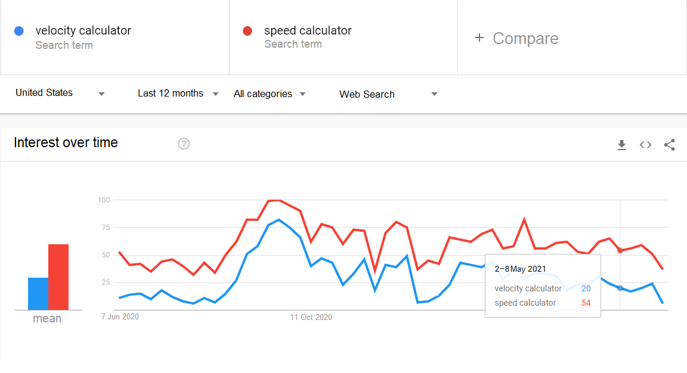

.. _alternatives:

Google Trends
=====================

.. _googleTrends:

  
  Comparison between *velocity calculator* and *speed calculator* keywords in Google Trends.
  
`Google Trends <https://trends.google.com/trends/?geo=US>`_ is another tool with which you can check the popularity of specific keywords in Google. Unlike SEMrush, Google Trends **does not provide the number of phrase searches (volume)**. Instead, it shows the relative interest over time expressed in percentages (0% - 100%). Google Trends has two advantages over SEMrush that you may use:

1. **Traffic over time** — Keywords traffic may change drastically over a year, e.g., kids don't use math calculators during holidays as much as during the school year. While SEMrush gives the average volume, Google Trends allows checking **how traffic was changing over a certain period** (since 2004, the last five years, last 12 months, etc.).
2. **Compare two or more keywords** — Google Trends can display the comparison between keywords traffic, which may be handy, e.g., when you have doubts about choosing the most appropriate name for the calculator. SEMrush shows only the average numbers that may underrate some keywords in some periods.
