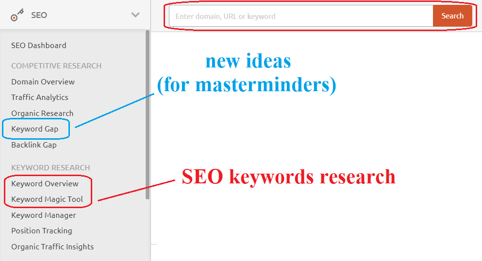

SEMrush
=================================================

.. _semrushDashboard:

  
    The main view of the SEMrush dashboard as for June, 2021.

In Omni Calculator, we use SEMrush for the United States only and assume other languages to have similar corresponding keywords' traffic. SEMrush offers at least three features that might be helpful for calculatorians:

- **Keyword Overview** - it offers a detailed analysis of a single keyword. The most crucial metric is a **volume** which is the average number of monthly searches. You can quickly access it using the top search bar.
- **Keyword Magic Tool** - it's the search engine for keywords. That's the best way to find keywords for specific calculators, so you will probably use only this one.
- **Keyword Gap** - allows the comparison between competitors and us. Our Masterminders team uses it to find ideas for the new calculators by looking at missing keywords. 

.. tip::
  The volume of the keywords is an average value that might evolve with time. If you have two keywords with similar traffic and you're not sure how you should name the calculator, using different tools, e.g., Google Trends, might make your decision easier.
  
.. toctree::

    :maxdepth: 2

    keywordMatch
    related
    filters
