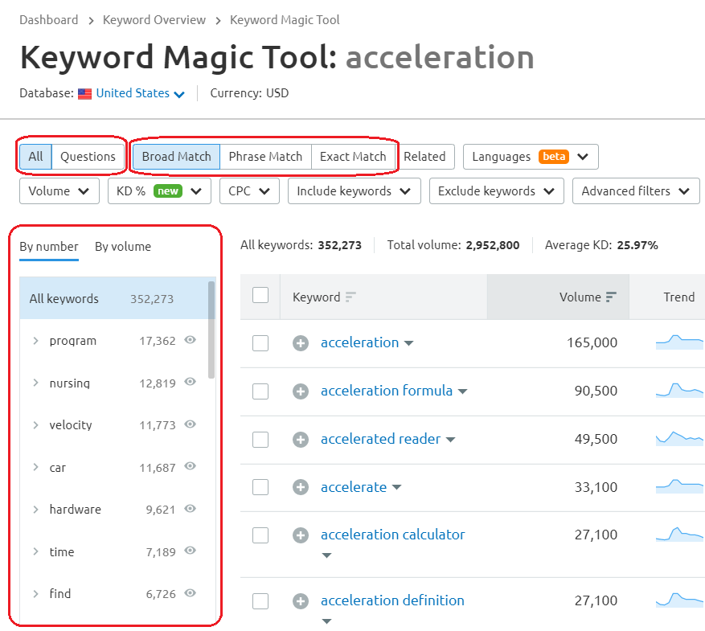

.. _keywordMatch:

Keyword match
=====================

.. _semrushMatch:

  
  The Keyword Magic Tool in SEMrush: Broad Match option.
    
When you're looking for keywords for your new calculators, the keyword match tool is the first one you should check. There are three options available:

- **Broad Match** — shows any variation of your keyword in any other;
- **Phrase Match** — shows exact keywords in various orders; and
- **Exact Match** — shows exact keywords in exact order.

The first option returns the broadest results and is the **recommended one**. However, when there are too many keywords listed, you might want to use the other two (see the example below). Whichever method you use, you should **sort the keywords list by volume** because it is the most interesting metric. 

.. note:: 
  For example, if you want to find all ideas for calculators connected with the word "acceleration", you can use **Phrase Match** and type in "acceleration calculator". In that way, you won't have to scroll down 5,000 keywords, but "only" 1,000.

On the left-hand side of the keyword match window, there is a **list of all words present in the found keywords**, sorted by the number of occurrences or volume. You can use this list, e.g., if you're looking for some inspiration for calculator texts.

.. tip:: 
  If you're interested in **question-based keywords** for an FAQ section, consider changing option *All*, to *Questions*, next to the *Broad Match* button.

