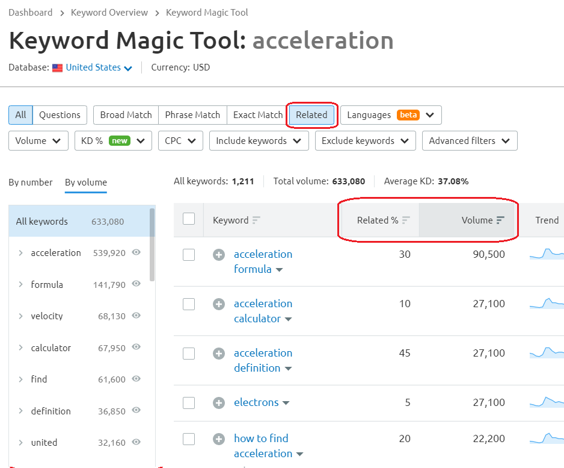

.. _related:

Related keywords
=====================

.. _semrushRelated:

  
  The Keyword Magic Tool in SEMrush: Related option.
    
The **related keywords** option returns a list of keywords often used with your keyword (i.e., similar keywords). We **recommend checking this feature**, as it might provide completely different keywords that are actually strongly related to your topic.

The most common situation when the **Related** option becomes handy is an alternative name of the problem you describe. For example, for the phrase "mortgage calculator", you can find "home loan calculator", which means the same, but it seems some users prefer to use this term instead.

.. tip::
  The list of related keywords is sorted by **relatedness** (Related %) by default. Since we’re looking for high-traffic keywords, it is good to **sort the list by volume**. You may find some unrelated keywords, but there is also a higher chance of finding interesting keywords with high traffic.
