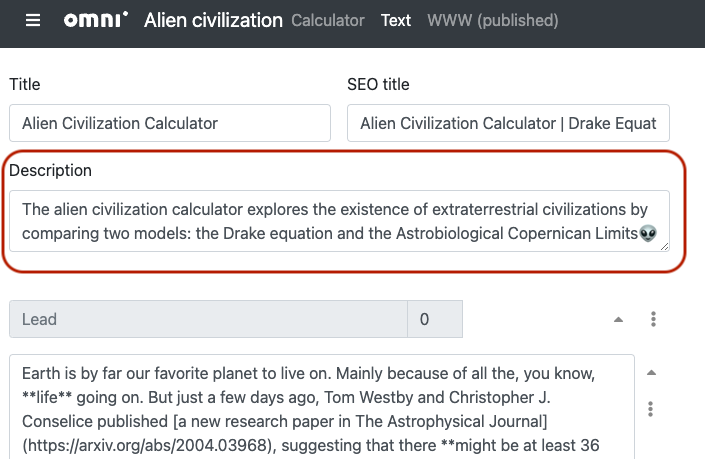
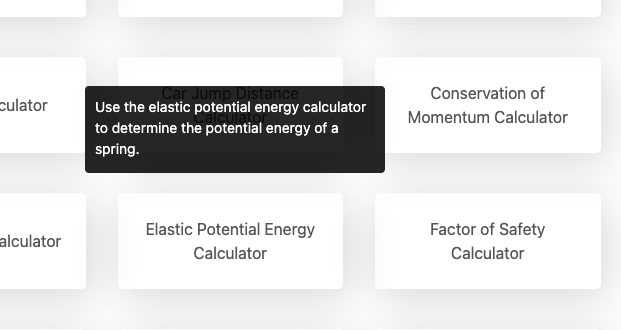
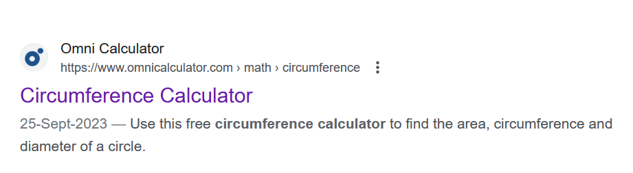
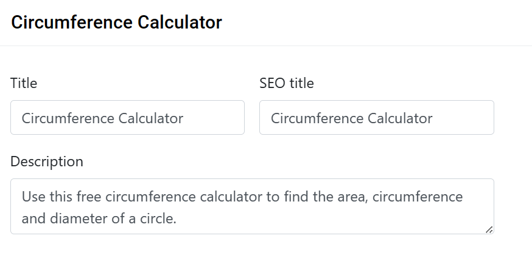

.. _description:

Description
===========

.. _descriptionExample:

    The calculator description text input box is after the title and SEO title.

Each calculator must have a **short description**, which is shown to the user of the calculator **category page** when they hover their mouse over a calculator.

.. _descriptionRenderedExample:

    Here's how your calculator's description will look to the user.

It should **briefly inform** them about what the calculator does and it's purpose. It should help **encourage** them to click through to the calculator.

Here are a few guidelines you should follow when writing a description for your calculator:

* **DO** use the **first keyword at least once**, preferably at the very beginning of the description;
* **DO** avoid repeating description at the beginning of the lead; and
* **DON'T** capitalize the calculator name.
  
Read on for more help to write a description for your calculator.

How to write a good meta description
------------------------------------

What is a meta description?
^^^^^^^^^^^^^^^^^^^^^^^^^^^

A meta description is an HTML attribute that provides a brief summary of the content of a web page. It's typically used by search engines to display a snippet or preview of the page in search results. Here's an example of how a meta description might look in HTML:

``<meta data-rh="true" content="Use this free circumference calculator to find the area, circumference and diameter of a circle." name="description"/>``

In this example, if someone searched for "circumference calculator" and this page appeared in the search results, the provided meta description might be displayed beneath the page title in the search results.

    ؜

**In the BB text editor, we refer to the meta description as "Description".**

Here are some key points about meta descriptions:

1. **Purpose**: The primary purpose of a meta description is to give searchers a quick insight into the content of a page, helping them decide whether or not to click on a search result. It can also play a role in improving click-through rates from search results.

2. **Placement**: It's placed within the ``<head>`` section of an HTML document, using the ``<meta>`` tag with the ``name`` attribute set to "description".

3. **Length**: While there's no strict limit, it's generally recommended that meta descriptions be between 50-155 characters long to ensure they display correctly in most search engines.

4. **Content**: It should be a concise and accurate representation of the page's content. It's also a good practice to include relevant keywords, but it's essential to avoid keyword stuffing.

5. **Customization**: If a meta description is not provided for a page or if it is not relevant to the webpage, search engines might generate one based on the page's content or use a snippet from the page that matches the user's query.

How do you write a good meta description?
^^^^^^^^^^^^^^^^^^^^^^^^^^^^^^^^^^^^^^^^^

Writing a compelling meta description is crucial for attracting users to click on our website from search engine results. Here are some best practices and tips for crafting an effective meta description:

1. **Be Concise**: Aim for a **length of 50-155 characters**. This ensures that your entire description is visible in most search engines without being cut off. You can use the `SERP simulator tool by Mangools <https://mangools.com/free-seo-tools/serp-simulator?ref=menu-mngls>`_ to check the length of the meta description. 

2. **Include Relevant Keywords**: Incorporate keywords that are relevant to the content of the page. This not only highlights the relevance of our page to searchers but also can make the keywords bold in search results if they match the user's query.

3. **Write for the User**: Our primary audience is the searcher, not search engines. Make sure the description accurately represents the content of the page and entices users to click through.

4. **Use a Call-to-Action (CTA)**: Encourage users to take action with phrases like “Calculate”, "Learn more," "Discover," or "Get started”.

5. **Avoid Duplicate Descriptions**: Each page on our website should have a unique meta description. Duplicate descriptions can make it difficult for users to distinguish between different pages on our site.

6. **Avoid Non-Alphanumeric Characters**: Some characters, like quotation marks, can get truncated or misinterpreted by search engines. It's best to avoid them or use HTML entities if necessary.

8. **Use Active Voice**: Active voice tends to be more engaging and direct, making it more compelling for users.

9. **Stay Updated**: If the content of our page changes significantly, remember to update the meta description to reflect those changes.

**Remember, a well-crafted meta description can significantly improve click-through rates, benefiting our SEO efforts.** These 1-2 lines are our opportunity to “advertise” our tools to the searchers, and the searcher's chance to decide whether our content is likely to be relevant to the information they are trying to get. Therefore, it is important that we put some effort into writing it. 

Can I use AI for creating meta descriptions?
^^^^^^^^^^^^^^^^^^^^^^^^^^^^^^^^^^^^^^^^^^^^

**Yes**, it is perfectly okay to use AI for creating meta descriptions. Some typical prompts for crafting meta descriptions are:

1. Suggest three possible meta descriptions for the webpage at https://www.omnicalculator.com/physics/absolute-humidity . The meta descriptions should be compelling and click-worthy. They should be concise and shouldn't be more than 155 characters.

2. Suggest three unique meta descriptions for the webpage at  https://www.omnicalculator.com/physics/wheatstone-bridge . The meta descriptions should be catchy with a call to action. They should be concise and shouldn't be more than 155 characters.

3. Write a meta description for a landing page about "ml to grams calculator". The description should contain the keywords "ml to grams converter" and "grams to ml".

.. note::
    The first two prompts are exclusive to ChatGPT 4.0 (premium) with the WebPilot plugin, while the third is accessible with the free version. The free version of ChatGPT doesn't have direct access to the web or the ability to crawl web pages. Instead, it analyzes provided URLs to infer and predict the page's title, providing suggestions based on this information.

How do I check the meta description of our competitors?
^^^^^^^^^^^^^^^^^^^^^^^^^^^^^^^^^^^^^^^^^^^^^^^^^^^^^^^

To check the meta description of a website:

1. Visit the site.

2. Right-click on ``View Page Source``.  Another option is to press ``Ctrl+Shift+I`` (Windows/Linux) or ``Command+Option+I`` (Mac) to open the browser's developer tools, then navigate to the "Elements" or "Inspector" tab.

3. Search for ``meta name='description'`` or ``meta property='og:description'``. This will locate the meta description tag.

4. Read the content inside the "content" attribute of the ``<meta>`` tag.

Am I allowed to edit the meta description during the translation process?
^^^^^^^^^^^^^^^^^^^^^^^^^^^^^^^^^^^^^^^^^^^^^^^^^^^^^^^^^^^^^^^^^^^^^^^^^

If you come across a generic meta description for any calculator, such as *'Use the heart rate calculator to find out all sorts of interesting things about your heart'*, **please notify us by contacting Purnima**, either through Slack or the Trello card. We will update the English version's description and provide guidance on addressing the issue in your language.

