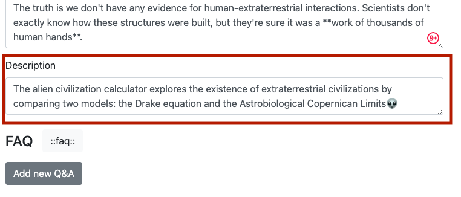
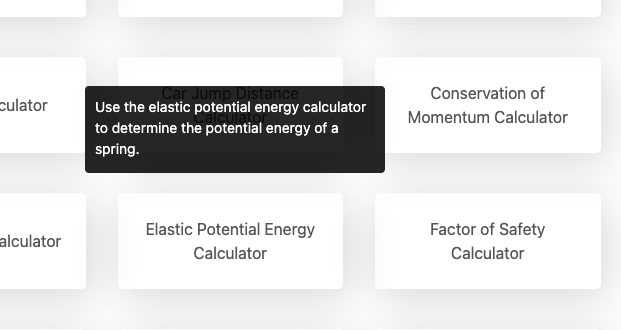

.. _description:

Description
=====================

.. _descriptionExample:

    The calculator description text input box is after the main text input box and before the FAQ section. [SCREENSHOT NEEDS UPDATING!!!!!!!!!!!!!!!!]

Each calculator must have a short description, which is shown to the user of the calculator **category page** when they hover their mouse over a calculator.

.. _descriptionRenderedExample:

    Here's how your calculator's description will look to the user.

It should **briefly inform** them about what the calculator does and it's purpose. It should help **encourage** them to click through to the calculator.

Here are a few guidelines you should follow when writing a description for your calculator:

* **DO** use the **first keyword at least once**, preferably at the very beginning of the description;
* **DO** avoid repeating description at the beginning of the lead; and
* **DON'T** capitalize the calculator name.
  
