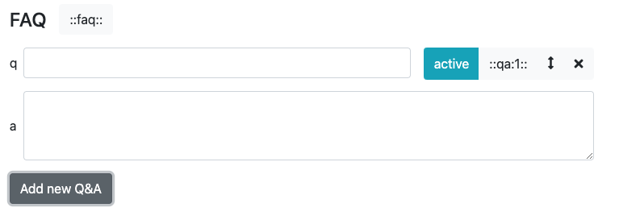
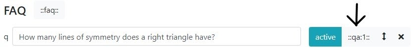
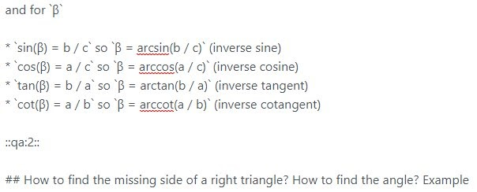
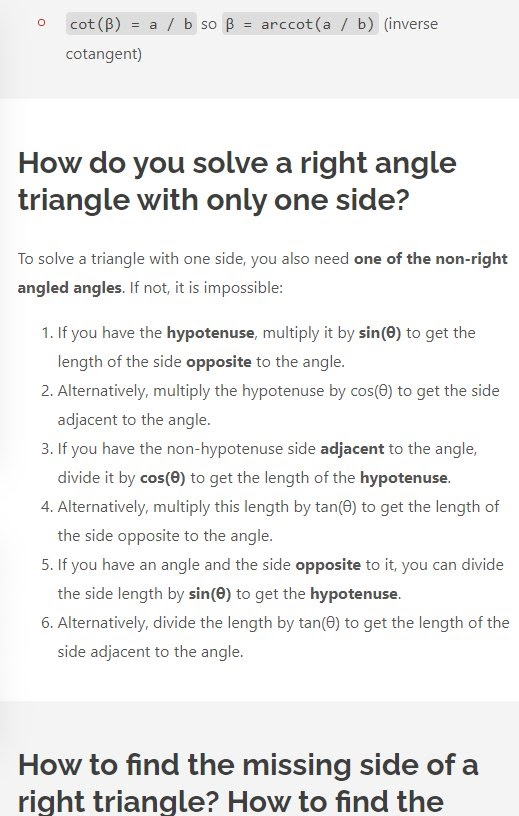
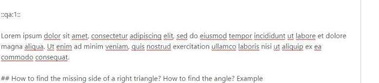
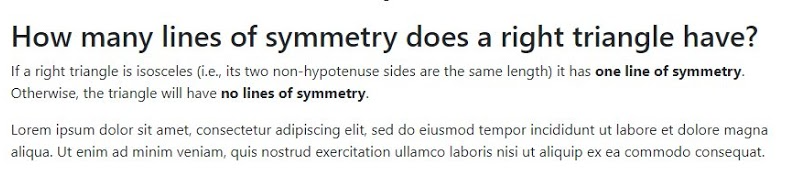

.. _faq:

FAQ
=====================

Adding frequently asked questions (FAQ) to a calculator is an opportunity for you to answer directly questions around the topic of your calculator.

Questions and answers in this section are formatted in such a way as to make it easier for Google to extract and display them as **featured snippets** and **Google FAQs**.

FAQs (frequently asked questions) are defined using two buttons to the right of the section title; **Schema** and **FAQ**.

The **Schema** button adds the section to the FAQ schema, but does not include it in the separate FAQ section. This is good when a section heading is naturally a question and you would like to include it with in the main text. For example, answering a question that helps you introduce a topic.

This section of the handbook will focus on how to technically use the FAQ section's buttons and options. To read about FAQs in general, checkout this section of the handbook: :ref:`FAQ Guide <faqGuide>`.

.. _faqExample:

    The FAQ section can be found just below the calculator description text box.

Adding an FAQ
-------------

To add a new FAQ, click the **Add new Q&A** button. You will then see a new, empty FAQ.

.. _faqNew:

In the box **q**, type in your question. Then enter your answer in the larger **a** text box.

Press the **Add new Q&A** button again to create the next FAQ.

Activating and deactivating FAQs
--------------------------------

When you create an FAQ, it is made **active by default**.

You can **deactivate** an FAQ by clicking the blue **active** button (turns yellow with the text changing to **inactive** when the FAQ is inactive).

When inactive, the FAQ will **not appear** on the live webpage.

Changing the order of FAQs
--------------------------

Click on the **up and down arrow icon** to drag and drop the FAQ to change the order. This affects the order of the FAQs in the separate FAQ section. 

Deleting an FAQ
---------------

Press the **cross icon** to delete an FAQ. You will be asked if you are sure you wish to delete it, to avoid mistakenly deleting FAQs.

.. _faqReferencingFAQinMainText:

Referencing an FAQ in the main text
-----------------------------------

If you would like to insert an FAQ into the main body of the text (instead of appearing in the separate FAQ section), you can do this using the ``::qa:x::`` button.

.. _faqQAButton:

    Here's where the button is to copy a reference to this FAQ to the clipboard.

By clicking this button, a tag (in this case ``::qa:1::``) will be copied to your clipboard. By copying this tag and **pasting** into the calculator’s text, that question and answer will be moved from the FAQ section to wherever its tag is in the text and the question will appear in the contents page. For example, in this case:

.. _faqQAInText:

Produces:

.. _faqInText:

This means that **important parts of the calculator’s text can be written in the appropriate place of the calculator as well as being an FAQ**. 

Additionally, **any text written after ::qa:x:: but before the next heading** will appear below the answer but under the same heading. This means that you can add a whole host of additional text after the answer that you couldn’t/didn’t want to put into the FAQ answer, and it won’t appear in Google.

For example:

.. _faqInlineText:

Becomes:

.. _faqInlineTextRendered:

All of this should make integrating FAQs into your text much easier than first imagined.

Moving where the FAQ section appears
------------------------------------

In certain instances, **you may not want the FAQ to be the final thing in the calculator’s text**, you may want a change log or disclaimer, for example. In that case, you can use the **::FAQ:: tag much in the same way as the ::qa:x:: tag**, except this time the whole FAQ section is moved.
