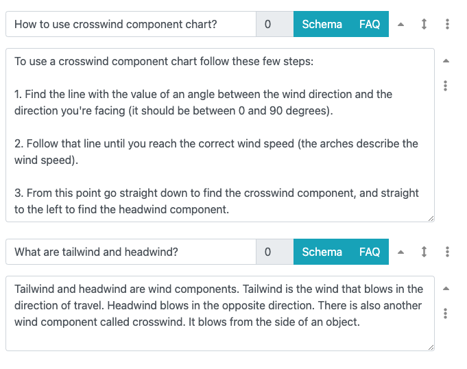
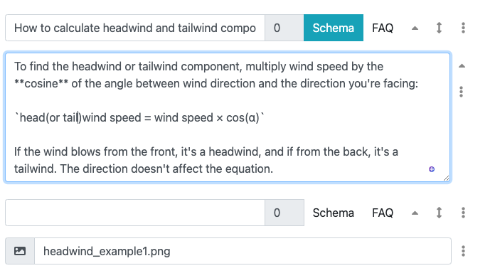

.. _faq:

FAQs
====

Adding frequently asked questions (FAQs) to a calculator is an opportunity for you to answer directly questions around the topic of your calculator.

Questions and answers are formatted in such a way as to make it easier for Google to extract and display them as **featured snippets** and **Google FAQs**.

This section of the handbook will focus on how to **technically define FAQs** for your text. To read about FAQs in general and how to write them, please checkout the :ref:`FAQ guide <faqGuide>` section of the handbook.

FAQs (frequently asked questions) are defined using two buttons to the right of the section title; **Schema** and **FAQ**.

The **Schema** button adds the section to the FAQ schema, but does not include it in the separate FAQ section. This is good to use when a section heading is naturally a question and you would like to include it with in the main text. For example, answering a question that helps you introduce a topic.

.. _faqExample:

  An FAQ is made out of a section block when a combination of **Schema** and **FAQ** buttons are active.

Adding an FAQ
-------------

To add a new FAQ, :ref:`add a new section <addNewSection>`` and click on the **FAQ button**. Then type in the question as the section heading and the answer in a text block below it (as shown in the example above). Your answer can include a :ref:`table block <textEditorTables>`.

If you want the FAQ to appear in the main part of the text and not in the FAQ section at the end, click on the FAQ buttons again to deselect it, leaving only the schema button activated.

.. tip::
  If you know an FAQ will be in the main text, you can click on the **Schema** button when creating the FAQ, instead of the FAQ button.

Changing the order of FAQs
--------------------------

Click on the **up and down arrow icon** to drag and drop the FAQ to change the order.

Deleting an FAQ
---------------

Delete an FAQ by deleting the section — click on the three-dot icon and select **Delete section**.

.. _faqReferencingFAQinMainText:

How to have an FAQ in the main text
-----------------------------------

If you would like to insert an FAQ into the main body of the text (instead of appearing in the separate FAQ section), you can do this using the **Schema** button activated and the FAQ button **deactivated**.

This means that **important parts of the calculator’s text can be written in the appropriate place of the calculator as well as being an FAQ**. 

Additionally, if you need to write more on that same topic, but **don't want included on Google** (e.g. to keep to recommended length), create a new section that doesn't have a title. This means that you can add a whole host of additional text after the answer that you couldn’t/didn’t want to put into the FAQ answer, and it won’t appear in Google.

For example:

.. _faqInlineText:

  Example of an FAQ in the main text with additional information not include in Google FAQ result (in this example the image will not appear in the FAQ answer on Google).

All of this should make **integrating FAQs** into your text much easier than first imagined.

