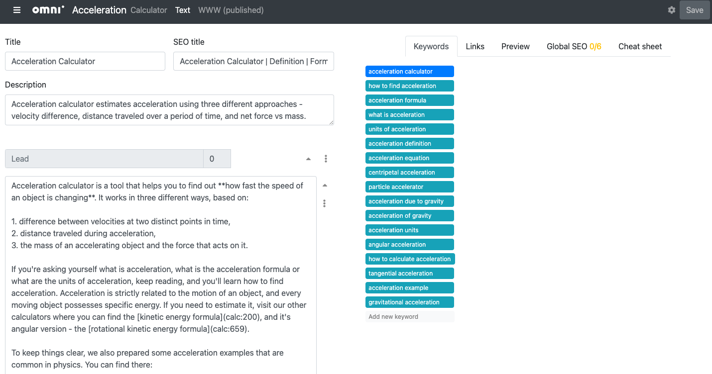

.. _editCalculatorText:

Edit calculator text
=================================================

This section of the Handbook is about how to **technically** write your calculator text. So it focuses on **how to do things**, rather than what to write.

.. _editCalculatorTextIntroImg:

  An example of the edit calculator text page.

It explains each section of the edit text page in detail:

.. toctree::
    :maxdepth: 2

    title
    description
    textEditor/intro
    faq
    revisions
    seoCheck/intro
