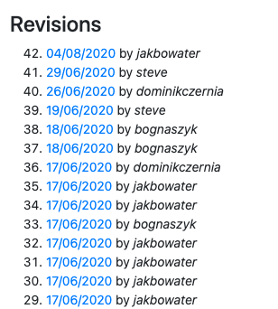
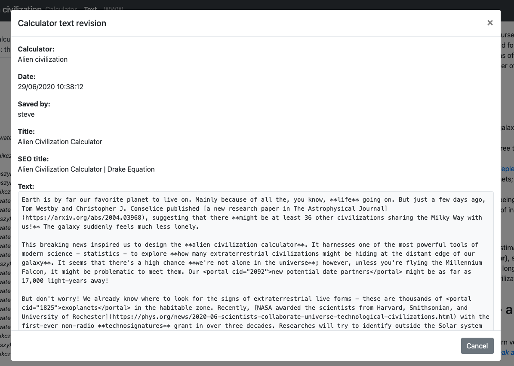

.. _revisions:

Revisions
=====================

The **Revisions** sections comes after the FAQ section. Every time you save your text, a copy of it is stored so you can inspect it in the future.

.. _revisionsExample:

Each revision is listed with the **date** it was saved and **who** saved it. This information is useful when more that one person is working on a calculator, or for tracking recent corrections and updates.

Click on the date to bring up all the text elements as they were for that revision.

.. _revisionsDetailedExample:

You can use a service like `diffchecker.com <https://www.diffchecker.com/diff>`_ to manually see what has changed between different revisions. 

.. note::
  The revisions feature will soon be getting more powerful, with things like being able to change which revision is the current live revision.