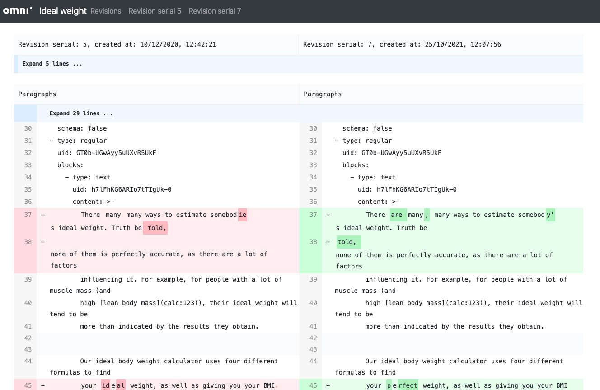

.. _revisions:

Text revisions
===============

The revisions system for texts **works exactly same** as the revisions system for calculators. So in order not to have too much repeated content in the manual, please make sure you have read through the :ref:`calculator revisions section <calcRevisions>`.

.. _revisionsIntroImg:

  An example of text revisions. You display this by either clicking on the revision info in the bottom-left of the page, or by clicking on the gear icon next to the save button and selecting **Revisions**.

.. note::
  You can also see the calculator revisions by clicking on **Calculator**. And you can see both together by clicking on **Text** so that both buttons have white backgrounds.

So with text revisions, you can name them, make them live, perform a difference check and base a text on a parent revision exactly the same as for calculator revisions.

.. tip::
  Text revisions are in green and start with the letter "t". This is in contrast to calculator revisions, which are blue in color and start with the letter "c".

You can mix and match which calculator and text revision is live. This means you can work on both aspects of a published calculator without letting the whole world know.

.. warning::
  If no text revision is made live, then the latest revision will be used on the live website. If you plan to make large changing to the text, **name and make live the most recent revision first**.

Diff checking
-------------

As an example, lets see how to do a difference check between two text revisions. First click the base of the diff check, but hovering your mouse over the revision and click on the **DD** icon. Then hover over a later revision and do the same.

.. _editCalcTextRevisionsDiffEg:

  An example of a text diff check.

In this example, we can see what the proofreader has changed. This is a great opportunity to learn for next time or query why a certain change was made.

