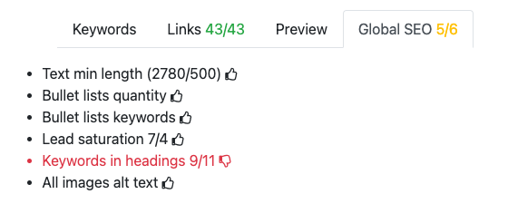

.. _globalSEO:

Global SEO
=====================

The **Global SEO** tab gives you general feedback on your calculator text, such as word length, bullet list quality, and have you remember to include alt text in all your images?

.. _globalSEOExample:

The general idea is to have **all six thumbs up**. If after trying really hard to get six, but you come up short, that's OK.

Let's explain each test in detail.

.. tip::
  Hover you mouse over an item to remind yourself what you need to do to get a 👍

Text min length
---------------

Your text should be **at least 500 words long** (including FAQ content). This test checks the word length of your text, and as a bonus, it tells you how many words is in your text. Very useful when following the :ref:`style guide advice on text length <textLength>`.

Bullet lists quantity
---------------------

This test checks the quantity of bullet lists in your text. There should be either at least **one** bullet list with **4 or more** items, or at least **two** bullet lists with **3 or more** items.

.. note::
  Bullet lists include **both** unordered (bulleted) and ordered (**numbered**) lists.

Bullet list keywords
--------------------

Checks whether the bullet lists have enough keywords. Bullet lists should contain at **least two** keywords.

Lead saturation
---------------

Checks whether there are enough keywords in the text lead (the text before the first heading). The required number will depend on the total number of keywords.

In the :ref:`example above <globalSEOExample>`, it tells us there are **7** keywords present out of a required **4**. That's great going. 👍

Keywords in headings
--------------------

Are there enough keywords in the **level 2 headings**? The target amount will depend on the number of keywords and text length. The first number is how many you have currently, while the second number is your target.

In the :ref:`example above <globalSEOExample>`, it tells us there are **9** keywords used in level 2 headings out of a required 11 keywords. Oh, no. Target not met. 👎 Try to add a new header or expand an existing one. Its okay to have 2 keywords in a header, as long as it still looks sensible.

All images alt text
-------------------

Do all the images used in the text also contain an **alt text**? This is essential for accessibility and if the image doesn't load, people will get an idea of what it shows.

There is no reason that all images shouldn't have an alt text. Check out the :ref:`pictures` section of the Handbook to see how to add them.
