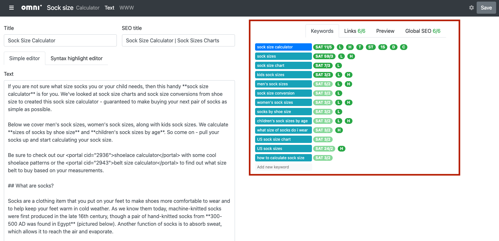

SEO check and other tabs
========================

The calculator text editor page has a number of SEO (search engine optimization) features that check that your calculator is the best it can be so Google will find it and rank it highly on its results page.

.. _seoCheckLocation:

    The SEO check tools are location on the right-hand side of the calculator text editor page.

There is the **Keywords tab**, where you list the keywords associated with this calculator. The SEO checker then makes sure your text has the right keyword saturation, keywords in headings, titles, description, etc.

The **Links tab** is where you can add and easily insert links to other related calculators.

The **Preview tab** gives you a preview of the rendered HTML, so you can check you have the right formatting, etc.

There is then the **Global SEO** that performs other checks on your text, such as length, bullet list quality and alt text for images.

Finally, there is the **Cheat sheet** tab that contains a handy reference to common Markdown syntax. The full reference of how Markdown is used at Omni is in the :ref:`Markdown<markdown>` section of this manual.

.. warning::
    The SEO checker **takes a few seconds to run when** you first open the calculator text editor page. Give it a chance to finish running before drawing any conclusions from the SEO checks.

To learn more about each of these tabs, use these links:

.. toctree::
    :maxdepth: 1

    keywords
    links
    preview
    globalSEO
    
    
