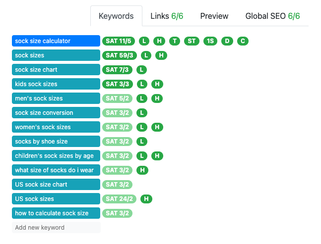
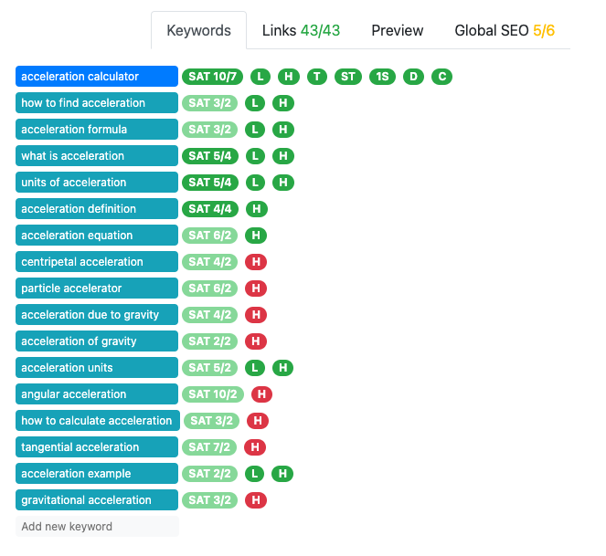
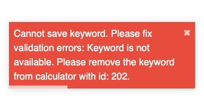
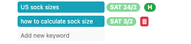

.. _keywords:

Keywords
=====================

The **Keywords tab** is probably the most important tab of the SEO checking tools. Here you register the keywords that are associated with your calculator.

.. _keywordsExample:

    An example of an all-green keywords tab.

The SEO checking then gives you feedback using a number of checks. Each check is abbreviated by a letter sequence:

* **SAT** — keyword saturation. The first number tells you how many times that keyword appears in the text. The second figure is your target to make this check green.

* **L** — lead text. Is this keyword in the lead (section of text before first ``##`` level 2 heading)? The lead should contain at **least four** keywords.

* **H** — heading text. Is this keyword used as part of a **level 2 heading**? Hover your mouse over an **H** to see how many keywords in headings you need.

The following checks are only performed in the main keyword of the calculator:

* **T** — title should contain the main keyword at the beginning;

* **ST** — SEO title should contain the main keyword at the beginning;

* **1S** — first sentence should contain the main keyword;

* **D** — description should contain the main keyword; and

* **C** — the first keyword should contain the word "calculator" or "converter".

If you are currently not passing all the keyword tests, these will be shown in the color red.

.. _keywordsRedExample:

In the example above, you need to add more keywords (the ones with the red **H**) to the level 2 headings.

.. warning::
  The SEO checker take a **few seconds to update** after you make a change to the text. This might mean you need to slow down if you are trying to fix one of the checks.

.. tip::
  You can remind yourself about what each check is asking for my hovering your mouse over it.

.. note::
  **Marketing** calculators can **ignore** the keyword checks as these calculators will be directly promoted and don't rely on Google search results.

Adding a keyword
----------------

To add a keyword, click on the text **Add new keyword** and type in the keyword. Then press **Enter** to save the keyword.

The first keyword you add should be the main keyword, as given on :ref:`Mastermind <mastermind>`.

Each keyword can only be associated with a **single calculator**. So if you try to add a keyword that already belongs to another keyword, you will see a message like this:

.. _keywordsDuplicate:

It helpfully tells you the existing calculator it is already associated with. Depending on the situation, it might make sense to move the keyword to your calculator. Always check with the other calculator's author, or the Calculatorian coordinator first.

Deleting a keyword
------------------

To delete a keyword, hover your mouse over it. A red trash can icon will appear on the right end of the line. Click this to delete the keyword.

.. _keywordsDelete:

.. warning::
  The interface will not ask whether you are sure you want to delete the keyword.
