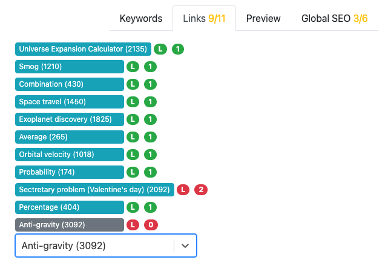
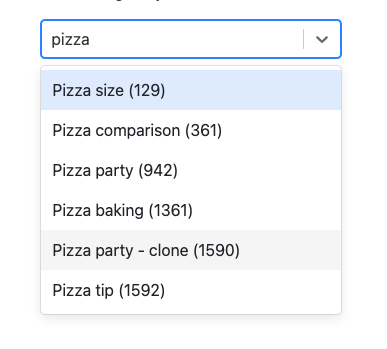
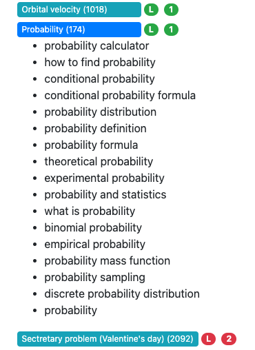
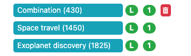

.. _linksTab:

Links
=====

The links tab is where you manage links to other calculators, based on keywords in your calculator text. The golden rule to remember is to **only include a link once** to each calculator.

.. _linksTabExample:

In the above example, the green links are present in the text once. The first red one is present twice, so one needs to be removed from the text.

Published calculators are colored blue, whereas unpublished calculators are colored grey. In this example, it isn't mentioned in the text yet.

.. note:: 
  It's OK to include a link to an **unpublished calculator**. For now the link will not appear in your text on the website. Once the target calculator is published, the link will appear and work as expected.

.. note::
  Links to a calculator that has been deleted are colored red with the text "Calculator link not found" and cannot be removed. You are free to ignore it.
  
  .. figure:: img/links-deleted.png
    :alt: links to deleted calculators are colored red
    :align: center

Adding a link
-------------

To add a calculator link, you have two options. You can either start typing the **name** of the calculator in the text box below the list of links, or give the calculator's **ID number**.

.. _linksTabAddByName:

Once you see the calculator you wish to add, simply click on it. Calculators with a **light grey background** are calculators that are **not published**. These maybe be old calculators or ones in development that will be published in future. You can **add unpublished calculators** to your text, but the link will not become active until the calculator being linked to is published.

.. note::
  When entering an ID number and there are **no results**, it means that there is no calculator with that ID. It must have been deleted. In that case, double check the ID of the calculator you wish to add.

Adding the link code to the text
--------------------------------

To actually add the link code to the text, here's what you do:

1. Click on the calculator link you wish to add. You will then see all the keywords that are associated with that calculator.
   
.. _linksTabKeywords:

2. Now place your cursor in the text where you want the link to appear.
3. Click on the **keyword** you wish to use as the link text. Don't worry! If you want to use some link text that **isn't listed as a keyword**, you can change in a minute.

4. If you want to change the link text, simply change the text enclosed by ``[]`` in the Markdown link.

.. note::
  A link to a related calculator has the following format:
  
  ``[link-text](calc:calculator-id])``

  It is perfectly possible to add the links manually, though you have to add the link to the links tab. Otherwise you will get the following error:

    *"Link to calculator of id XXX is included in the text but not listed in links panel. Either add it to links panel manually or remove it from the text."*

.. tip::
  You you want to hide the list of keywords of a linked calculator again, simply click on it again.

Deleting a link
---------------

To delete a link from the list, hover over the link and click on the **red trash** can icon at the end of the line.

.. _linksTabDelete:

Note, that this **does not also delete the link code from your text**. If it exists, make sure to do this manually. If you don't a warning will be given in the links tab.

.. note::
  Changes to the list of linked calculators are save immediately. There is no need to save the calculator, so you will not see the **Save** button turn yellow.
  
  Furthermore, changes to the list of linked calculators are not stored in the :ref:`revisions <revisions>` of the calculator text.
