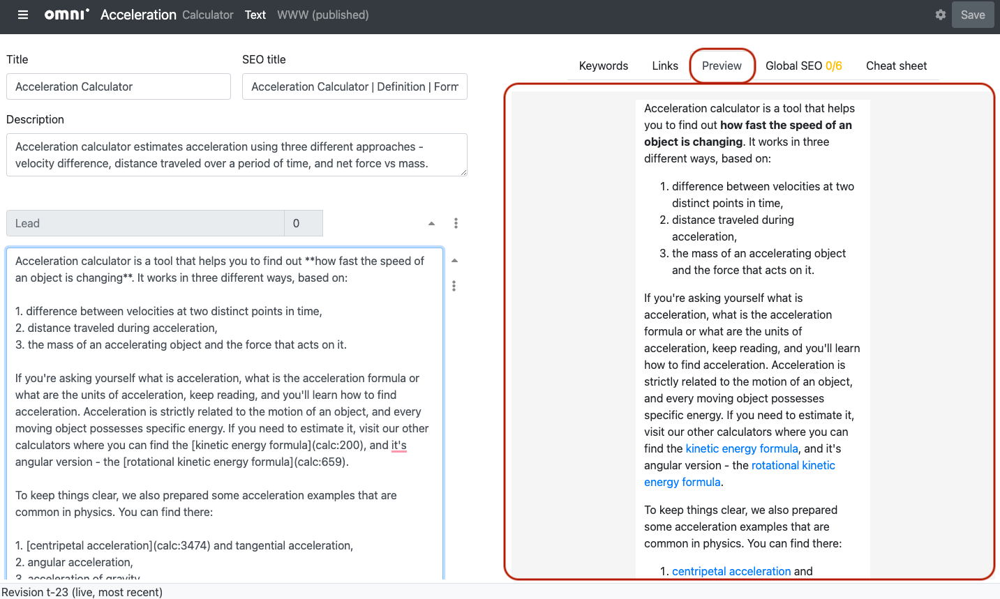

.. _preview:

Preview
=======

The **Preview tab** is where you can see a basic preview of how your lovely formatted text will look on the website.

.. _previewExample:

   Example of the preview section of the edit calculator text page, highlighted in red.
   
It will help you quickly fix most of the formatting issues that you may come across as you type in your text.

The default view is the **same width as a typical mobile phone**. So if the calculator looks good here, it should look good on a phone too (please double-check though).

.. note::
   You only see the preview for the **currently selected section**. To see the preview of the next section, click on a section heading or one of the section's blocks.

.. warning::
  This preview is **not 100%** how things will look on the actual site. As a final check, **always see what your calculator looks like on the website**. You can get to a draft of your calculator by clicking the **WWW** link at the top of the page.

