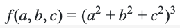
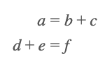
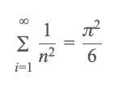
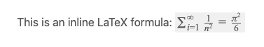

.. _textEditorFormulaBlock:

Formula block
=============

.. contents:: Table of contents:
  :local:

A formula block allows you to enter a mathematical formula using **LaTex formula notation** (thanks to a library called KaTeX). If you are a mathematician or write your academic papers using TeX, you'll feel right at home. For everyone else, here is a brief introduction.

Let's start with something simple. The following input:

.. code-block::

  f(a,b,c) = (a^2+b^2+c^2)^3

will be rendered as:

.. _formulaSimpleEg:

  Simple example of formula block output.

A common situation is that you are working through a calculation and you would like the equals sign to line up. Here is an example of how you do that:

.. code-block::

  \begin{aligned}
    a&=b+c \\
    d+e&=f
  \end{aligned}

.. _formulaAlignedEg:

  An example of aligning the equals signs of multiple equations.

The ``\\`` starts a new line and the ampersand ``&`` tells LaTeX that we want to align the two formulas on the equals sign.

Here is another example:

.. code-block::

  \sum_{i=1}^\infty\frac{1}{n^2}=\frac{\pi^2}{6}

.. _formulaSumEg:

  Another example of a formula block.

Hopefully you can see that a lot is possible by using LaTeX-style formula blocks. However, a full course on learning LaTeX is beyond the scope of this manual.

Instead, review the `full list of supported symbols and functions <https://katex.org/docs/support_table.html>`_ on the KaTeX website to learn more. 

.. note::
  There are no options associated with formula blocks.

.. tip::
  LaTeX can do pretty much anything and look just like a text book. However, it does require a bit of knowledge and researching what symbols, codes and commands to use to get the result you are looking for. If KaTeX docs and Google can't help, **please post on Slack and ask**. Much better to have a beautiful formula than an ugly one, now that we can do them.

Issues with spacing
-------------------

The convention with LaTeX-style formula is to have no multiplication sign (though one is available by using ``\times``). If the terms of an equation has subscripts/superscripts, it can make the formula hard to read. Here is an example:

.. _formulaPoorSpacingEg:

  An example of a formula where spacing makes it hard to read.

You will find that LaTeX with ignore any extra spaces. You need to input one of the space codes instead, such as ``\``. So to add some spaces to the above formula, you have the input:

``N = R_* \ f_p \ n_e  \ f_l  \ f_s  \ f_t  \ L``

Which gives the result:

.. _formulaGoodSpacingEg:

  Adding a space between the terms makes it easier to read.

There are many codes for different amounts of space (including making the terms closer):

* ``\!`` — Negative thin space;
* ``\,`` — Thin space;
* ``\`` — Control space;
* ``\:`` — Medium space; and
* ``\;`` — Thick space.

That'll probably be enough, but there are more `here <https://tex.stackexchange.com/a/74354>`_.

.. _inlineLatex:

Inline LaTeX formulas
---------------------

You can also put LaTeX-style formulas in a text block by surrounding the LaTeX with two dollar signs, like this:

.. code-block::

  This is an inline LaTeX formula: $$\sum_{i=1}^\infty\frac{1}{n^2}=\frac{\pi^2}{6}$$

Notice how the equation has been squashed down to fit on a single line of text. However, if the LaTeX code is multi-line, trying to place it inline with the text won't work.

.. _formulaInlineEg:

  An example of an inline LaTeX-style formula.

.. warning::
  Please don't put LaTeX-style formulas in FAQ answers, as they won't appear correctly on Google. Use :ref:`backticks<equations>` or bold text instead.

Errors
------

If there are syntax errors in the input, these will be **displayed in the preview as red text**. Double-check with the KaTeX documentation to see if the function is supported or you are using a function correctly. If you need help resolving an error, just ask!

Useful LaTeX resources
----------------------

Here are some resources that will help you create LaTeX equations.

* `KaTeX Support Table <https://katex.org/docs/support_table.html>`_ — Double-check what is supported by KaTeX, the LaTeX library Omni uses.
* `Detexify LaTeX handwritten symbol recognition <https://detexify.kirelabs.org/classify.html>`_ — Allows you to draw a math symbol and gives you the LaTeX code.
* `Mathpix Snip <https://mathpix.com/>`_ — Convert images (including handwritten formulas) and PDFs into LaTeX code.