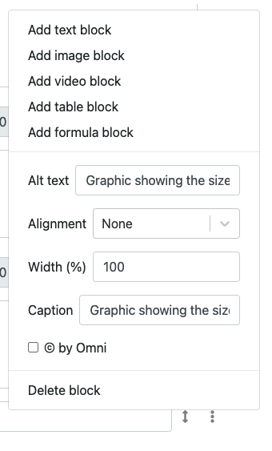

.. _textEditorImageBlock:

Image block
===========

To enrich your text, you can add pictures, graphs and diagrams using an **image block**. To add an image block to a section, click on the three-dot icon of the block where you would like the image to appear and select **Add image block** from the first section of the menu.

You then need to specify the URL of the image, be it on Omni's FTP server or hosted on Wikimedia.

.. _imgBlockURLExample:

    Example of an image block with a URL to the image you want to use.

.. warning::
  **Please don't link directly to images on any old website.** It has to be able to serve the image quickly to our users, which, for example, Wikipedia does. If in doubt, upload the image to our FTP server.

.. _imgBlockMenu:

    Image block options menu.

Click on the three-dot icon to display the options menu for an image block, which are covered next.

.. note::
  Please only use an image block to add an image to your text. Use of Markdown and HTML have been deprecated.

Alt text
--------

Every image **needs** to have some alternative text (alt text) to display to the user if the image can't loaded, or to be read out to user who use screen readers. Describe what the image is about in a short sentence, for example, "pentagon shape with its diagonal (d) and height (h) marked".

.. warning::
  **You cannot save the calculator text if an image is missing its alt text.** The three-dot menu button of the image block without alt text will be highlighted in red and when you open it, you should see an error message asking you to provide an alt text.

.. _textEditorImageBlockAlignment:

Alignment
---------

This specifies the horizontal alignment of the image. This option is only apparent if the image width is less than 100% (see next section).

Here are the alignment options and there affects:

* **None** — Image will be aligned to the left and nothing will be placed to the right of the image.
* **Center** — Image is placed in the center of the text column, always on its own.
* **Left** — Image is placed to the left and the next block will float to the right of the image.
* **Right** — Image is placed to the right and the next block will float to the left of the image.

.. tip::
  Using a combination of alignment and image width, you can place multiple images next to each other on the same row. Just make sure they don't get too small to see on mobile.

.. _imgBlockLeftAlignEg:
.. figure:: img/image-block-left-align-eg.png
    :alt: Example of left aligned image with text floating to the right.
    :align: center

    Example of left aligned image with text floating to the right.

Width
-----

Specifies the width of the image in terms of **percentage** of the content width. If you specify 0%, the image will be shown at its native size, though if it is too large for the content column, it will be reduced in size to fit. 

Caption
-------

Allows a caption to be written below the image to help describe it to the user. This is also a good place to specify the source of the image, if necessary. You can link to the source using :ref:`Markdown link syntax <linksMarkdown>`.

.. _textEditorPicturesUpload:

How to upload pictures?
-----------------------

1. Download Filezilla Client: https://filezilla-project.org
2. Install it on your computer.
3. Log in (details in the "`Omni Common <https://drive.google.com/drive/u/0/folders/1CW8H5OP9cdzvHRyO7IJR2tKHkBD20jUy>`_ → Shared Accounts" file).
4. Put the pictures you want to upload in the “images” folder. Make sure that the pictures are open source (good sources are, e.g., `www.pexels.com <https://www.pexels.com/>`_ or https://unsplash.com) and that they’re not too large (ideally less than 100 KB — you can decrease their file size by using, e.g., https://tinypng.com). Here is :ref:`how to resize images <picturesHowToResize>`.
5. The images are available at the following URL: ``https://uploads-cdn.omnicalculator.com/folder_name/file_name``. For example: https://uploads-cdn.omnicalculator.com/fbimages/car-vs-bike-screenshot.png
6. You can now add the image to the image block, as discussed in the previous section.

Free to use pictures resources
------------------------------

* https://www.pexels.com/
* https://unsplash.com/
* Google → images → Tools → Usage Rights → Creative Commons licenses

Stock photo account
-------------------

Omni has an account with `Depositphotos <https://depositphotos.com/>`_. See the "`Omni Common <https://drive.google.com/drive/u/0/folders/1CW8H5OP9cdzvHRyO7IJR2tKHkBD20jUy>`_ → Shared Accounts" file for login details.

How to attribute the author?
----------------------------

**External sites:** Image caption (link to homepage), e.g.:

   Image caption ([example.com](https://www.example.com/))

**Wikipedia:**

1. Select a picture on Wikipedia.
2. Click on the download button.
3. If you see, "You need to attribute the author", include the author's name and a link back to the main Wikimedia page in the **image caption**.
4. If you see, "You can attribute the author", click more details and check the licensing and what you should do.
5. If public domain, it's free to use with no attribution.

.. _picturesWikipediaAttribution:
.. figure:: img/pictures-wikipedia-attribution.png
   :alt: example of clicking the download button to see whether you need to give attribution 
   :align: center

   Example of where you check to see if you need to give attribution to a picture on Wikipedia. 
