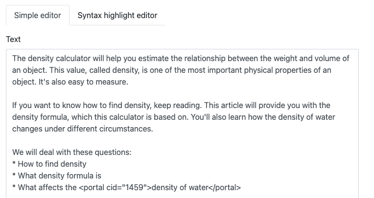
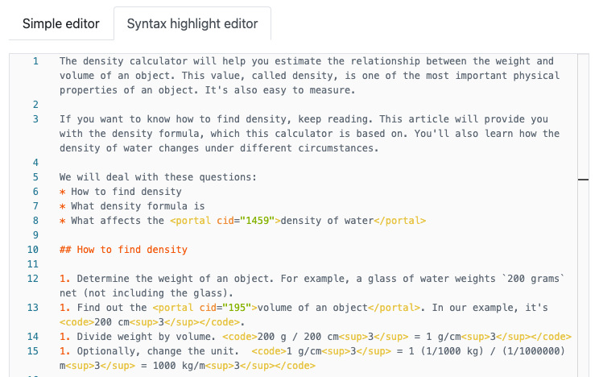

.. _textEditorIntro:

Simple editor and syntax highlight editor
=================================================

This is where most of the text for your calculator gets written. You will mainly use Markdown to format the text, plus some HTML (though the use of HTML will soon be deprecated).

.. _textEditorSimple:

    The **Simple editor** is a regular text area input field.

.. _textSyntaxSimple:

    The **Syntax highlight editor** highlights Markdown and HTML syntax.

You can choose between two views of the calculator text: **simple editor** and **syntax highlight editor**. Each has it's advantages and disadvantages. Here are a few:

* The :ref:`Grammarly <grammarly>` spelling and grammar checker only works in the simple editor.
* The syntax highlight editor uses the same interface as the CustomJS code editor, so you can do things like find and replace. Right-click on the text and select **Command Palette** to explore the functions available.
* Having the Markdown and HTML coloured might help you to quickly navigate your text and spot syntax issues.

As you make changes in one view, these will be reflected in the other view. So feel free to **switch between them** at any time.

In this section of the handbook, we will cover the following topics on how to create the perfectly formatted text.

.. toctree::
    :maxdepth: 1

    markdown
    symbols
    equations
    links
    anchors
    pictures
    tables
    videos
    html
    
    
