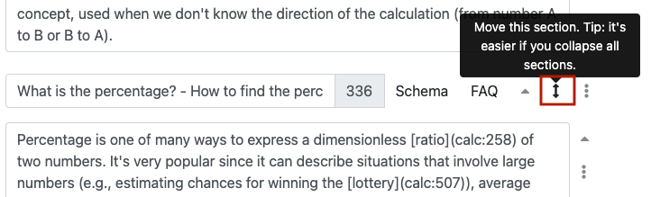

.. _textEditorIntro:

Text editing with sections and content blocks
=============================================

The calculator text editor consists of a number of sections (equivalent to level 2 ## headings) and content blocks (different block types for different content types).

  Example of the text editor page.

Section blocks
--------------

A section is the top-level building block of your calculator text. Each section has a title and contains a several :ref:`content blocks<textEditorIntroContentBlocks>`.

.. note::
  The section title is what you used to denote with ## in the previous text editor.

Every calculator has a special "Lead" section, with at least one text content block. While you cannot delete this text block, you can add more blocks to the lead section.

.. _addNewSection:

To **add a new section**, click on the three-dots icon to the right of the section title and click **Add section**. For other sections that come after the lead section, you can delete the section by selecting **Delete section** from the section drop-down menu.

  Adding and deleting a section block.

.. tip::
  The number after the title of a section indicates the **number of words** contained within that section.

.. seealso::
  FAQs (frequently asked questions) are defined using two buttons to the right of the section title; **Schema** and **FAQ**.

  Learn more about managing FAQs in the :ref:`FAQs technical section <faq>`  of the manual. 

.. _textEditorIntroContentBlocks:

Content blocks
--------------

Content blocks are the heart of the text editor. There are currently five different types:

* :ref:`Text block <textEditorTextBlock>` — Entering paragraphs of text.
* :ref:`Image block <textEditorImageBlock>` — Adding images to text.
* :ref:`Video block <videos>` — Adding embedding videos in text (marketing/SciComm calculators only really).
* :ref:`Table block <textEditorTables>` — Adding tables to text.
* :ref:`Formula block <textEditorFormulaBlock>` — Adding fancy LaTeX-style equations to text.

.. note::
  To delete a content block, click on the **three-dot icon** and click on **Delete block**. Note that the first text block of a section cannot be deleted.

.. warning::
  Blocks are currently **deleted right away** and you are not asked whether you are sure. To avoid losing text, it might be a good idea to write your text in another application initially.

.. toctree::
  :hidden:
  :maxdepth: 1

  textBlock
  imageBlock
  videos
  tables
  formulaBlock

Reordering sections and content blocks
--------------------------------------

To change the ordering of content blocks or sections, use the up and down arrow icon to drag the block up or down.

  Move a section or content block by clicking and dragging on the up and down arrow icon.

.. tip::
  You might find it easier to **collapse all** the sections when **moving sections around**. You can do this by clicking on the gear cog icon next to the save button and selecting **Collapse all sections**.

  Also, when moving content blocks within a section, collapsing them all first is better. See next section for how to collapse and expand content blocks.

Collapsing and expanding section and content blocks
---------------------------------------------------

To collapse a section or content block, click on the up arrow icon.

  Collapse a section by clicking the up arrow icon.

To expand a collapsed section or content block, click on the down arrow icon.

  Expand a block by clicking the down arrow icon. It's orange to indicate that it is collapsed.

Formatting text
---------------

The following topics help you to create perfectly formatted text.

* :ref:`Markdown <markdown>` — Basic formatting of text, such as bold, italic, subscript, etc.
* :ref:`Symbols <symbols>` — How to add mathematical symbols, emojis, etc.
* :ref:`Equations <equations>` — How to format equations using code (instead of LaTeX-style formula blocks).
* :ref:`Links <links>` — How to add internal and external links to text.
* :ref:`Anchors <anchors>` — Add anchors to jump to a section of the calculator or go back to the top of the calculator.
* :ref:`HTML <html>` — Details on how HTML tags will be **phased out** of calculator texts.

.. toctree::
  :hidden:
  :maxdepth: 1

  markdown
  symbols
  equations
  links
  anchors
  html

