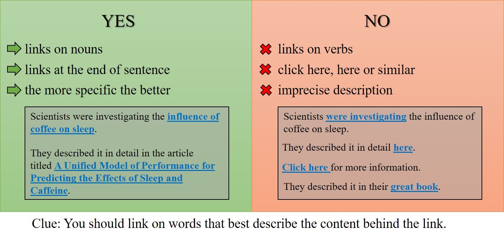

.. _links:

Links
=====================

Here are some general DOs and DON'Ts when creating any link from your text.

.. _linksBestPractice:

Internal links — linking to other calculators
---------------------------------------------

To link to another calculator, the easiest way is to use the **Links** tab. You can find out how to do that on the :ref:`links <linksTab>` tab page of this handbook.

You can add a link manually using the ``<portal>`` tag, like this:

* ``<portal cid="xxx">link text</portal>``

where ``xxx`` is the ID number of the calculator you wish to link to.

An example is:

* ``<portal cid="630">sleep</portal>``

Markdown
--------

To create a link using Markdown syntax, type the following:

* ``[link text](http://www.example.com)``

Linking to sections within the same calculator
----------------------------------------------

If you want to make an anchor (internal link) to the other paragraph within your text, all you need to do is:

1. Check the preview of your calculator, and click on the header in the *Table of contents* you want to link to — e.g., "How to use this calculator".
2. You are moved to that paragraph and the address has the paragraph slug after the hash. Copy it, # included. ``#how-to-use-this-calculator``
3. Embed the link in the text using Markdown as usual, you don't need to put whole omni address here:

   * "Find out [how to use](#how-to-use-this-calculator) section below."
