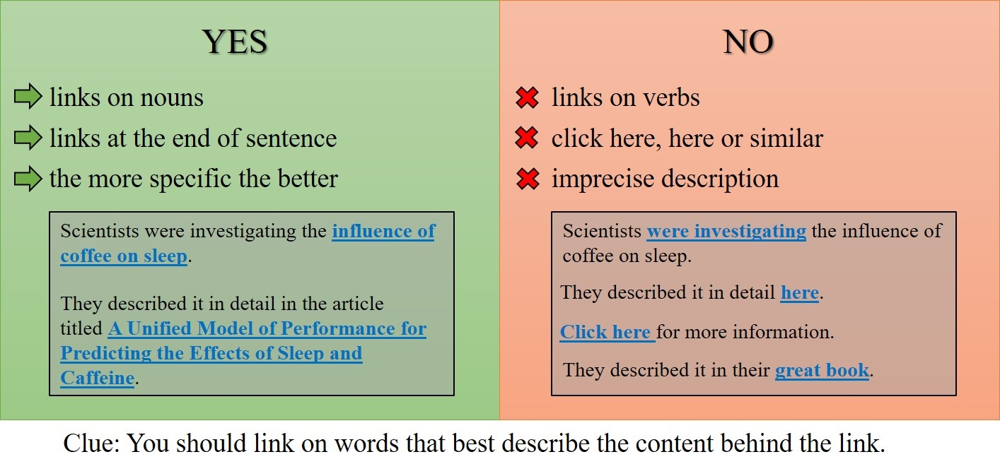

.. _links:

Links
=====

Here are some general DOs and DON'Ts when creating any link from your text.

.. _linksBestPractice:

    
For more tips on adding internal links, please visit the :ref:`Internal Link <internalLinks>` section

.. _linksInternal:

Internal links — linking to other calculators
---------------------------------------------

To link to another calculator, the easiest way is to use the **Links tab**. You can find out how to do that on the :ref:`links tab<linksTab>` page of this handbook.

You can add a link manually using Markdown, like this:

* ``[link text](calc:xxx)``

where ``xxx`` is the ID number of the calculator you wish to link to.

An example is:

* ``[sleep](calc:630)``

You must NOT **link to a section within another calculator**. This is due to issues that arise as we move toward a multilingual.

.. _linksMarkdown:

External links — linking to other websites
------------------------------------------

To create a link to an external website using :ref:`Markdown <markdown>` syntax, use the following syntax:

* ``[link text](http://www.example.com)``

