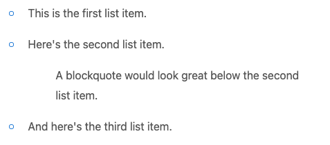
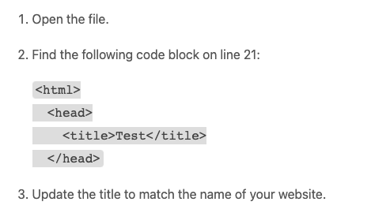
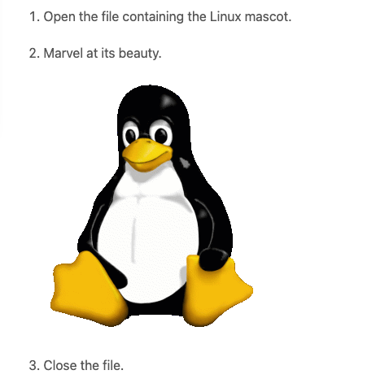
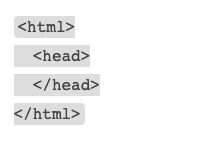

.. _markdown:

Markdown
=====================

The main way to format your texts is to use the **Markdown syntax**. Note that Omni doesn't support everything in Markdown, but it does support the following:

.. contents:: :local:
  :depth: 1

Headings
--------

To create a heading, place hash characters in front of the word or phrase.

The usual heading level is level 2, so you add two hash characters:

* ``## Heading level 2``

You can also specify level 3 and 4 headings, though because there isn't much difference visually between 2 and 3, 3 is hardly ever used.

You can also use **bold text** as a heading (see next section).

.. warning::
  Never use a level 1 heading (``#``). This is the heading level of the title of the calculator article.

Bold
----

To create bold text, surround it with two asterisks, like this:

* ``**bold text**`` → **bold text**


Italic
------

To italicize text, surround the text with a single asterisk or underscore character, like this:

* ``*italicized text*`` → *italicized text*
* ``_italicized text_`` → *italicized text*

.. tip::
  You can italicize the middle of a word, but **only** by using the asterisk method:

  * ``A*cat*meow`` → A\ *cat*\ meow

Bold and italic
---------------

You can combine the two syntaxes and use three asterisks around text you wish to bold and italicize:

.. role:: raw-html(raw)
   :format: html

* ``This text is ***really important***.`` → This text is :raw-html:`<i><b>really important</b></i>`.
* ``This text is ___really important___.`` → This text is :raw-html:`<i><b>really important</b></i>`.
* ``This text is __*really important*__.`` → This text is :raw-html:`<i><b>really important</b></i>`.
* ``This text is **_really important_**.`` → This text is :raw-html:`<i><b>really important</b></i>`.
* ``This text is really***very***important.`` → This text is really\ :raw-html:`<i><b>very</b></i>`\ important.

Note that for the last example, only asterisks will work, not underscores.

Blockquotes
-----------

To create a blockquote, add a > in front of a paragraph.

* ``> This is a blockquote paragraph.``

Currently, the style of the website means blockquotes are **only indented**. This might change in the future though, so if you **just want to indent text** to include it as part of a list item, use 4 spaces to indent instead.

Lists
-----

Lists can either be ordered (numbered) or unordered (bullet point list).

Ordered lists
^^^^^^^^^^^^^

To create an ordered list, add line items with numbers followed by periods. The numbers don’t have to be in numerical order, but the list should start with the number one.

+------------------------+----------------------+
| Markdown               | Rendered output      |
+------------------------+----------------------+
| .. code:: md           |                      |
|                        |                      |
|   1. First item        | 1. First item        |
|   2. Second item       | 2. Second item       |
|   3. Third item        | 3. Third item        |
|   4. Fourth item       | 4. Fourth item       |
+------------------------+----------------------+
| .. code:: md           |                      |
|                        |                      |
|   1. First item        | 1. First item        |
|   1. Second item       | 2. Second item       |
|   1. Third item        | 3. Third item        |
|   1. Fourth item       | 4. Fourth item       |
+------------------------+----------------------+
| .. code:: md           |                      |
|                        |                      |
|   1. First item        | 1. First item        |
|   8. Second item       | 2. Second item       |
|   3. Third item        | 3. Third item        |
|   5. Fourth item       | 4. Fourth item       |
+------------------------+----------------------+
| .. code:: md           |                      |
|                        |                      |
|   1. First item        | 1. First item        |
|   2. Second item       | 2. Second item       |
|   3. Third item        | 3. Third item        |
|       1. Indented item |     1. Indented item |
|       2. Indented item |     2. Indented item |
|   4. Fourth item       | 4. Fourth item       |
+------------------------+----------------------+

For the last example, use **4 spaces** to indent the second level of ordered list.

Ordered list best practices
"""""""""""""""""""""""""""

While you can define an ordered list using a parenthesis instead of a period, it's not supported by all Markdown libraries. So in case Omni ever change the Markdown library, use period only.

+------------------------+------------------------+
| ✅ Do this             | ❌ Don't do this       |
+------------------------+------------------------+
| .. code:: md           | .. code:: md           |
|                        |                        |
|   1. First item        |   1) First item        |
|   2. Second item       |   2) Second item       |
|   3. Third item        |   3) Third item        |
|   4. Fourth item       |   4) Fourth item       |
+------------------------+------------------------+

Unordered lists
^^^^^^^^^^^^^^^

To create an unordered list, add dashes (-), asterisks (*), or plus signs (+) in front of line items. Indent one or more items to create a nested list. 

+-----------------------+----------------------+
| Markdown              | Rendered output      |
+-----------------------+----------------------+
| .. code:: md          |                      |
|                       |                      |
|   * First item        | * First item         |
|   * Second item       | * Second item        |
|   * Third item        | * Third item         |
|   * Fourth item       | * Fourth item        |
+-----------------------+----------------------+
| .. code:: md          |                      |
|                       |                      |
|   - First item        | * First item         |
|   - Second item       | * Second item        |
|   - Third item        | * Third item         |
|   - Fourth item       | * Fourth item        |
+-----------------------+----------------------+
| .. code:: md          |                      |
|                       |                      |
|   + First item        | * First item         |
|   + Second item       | * Second item        |
|   + Third item        | * Third item         |
|   + Fourth item       | * Fourth item        |
+-----------------------+----------------------+
| .. code:: md          |                      |
|                       |                      |
|   * First item        | * First item         |
|   * Second item       | * Second item        |
|   * Third item        | * Third item         |
|       * Indented item |    * Indented item   |
|       * Indented item |    * Indented item   |
|   * Fourth item       | * Fourth item        |
+-----------------------+----------------------+

.. warning::
  Don't mix and match delimiters, as it won't work. Choose one (``*`` is preferred) and stick to it.

Starting unordered list items with numbers
""""""""""""""""""""""""""""""""""""""""""

If you need to start an item with a number and a period, you can escape the period with the backslash (``\``) character.

+-----------------------------------+---------------------------------+
| Markdown                          | Rendered output                 |
+-----------------------------------+---------------------------------+
| .. code:: md                      |                                 |
|                                   |                                 |
|   * 1968\. A great year!          | * 1968\. A great year!          |
|   * I think 1969 was second best. | * I think 1969 was second best. |
+-----------------------------------+---------------------------------+

Adding elements to list items
^^^^^^^^^^^^^^^^^^^^^^^^^^^^^

To add another element to a list item while preserving the continuity of the list, indent the element by four spaces or one tab. Here are some examples.

Paragraphs
""""""""""

.. code:: md

  * This is the first list item.
  * Here's the second list item.

      I need to add another paragraph below the second list item.

  * And here's the third list item.

This will be rendered as:

* This is the first list item.
* Here's the second list item.

  I need to add another paragraph below the second list item.

* And here's the third list item.

Blockquotes
"""""""""""

.. code:: md

  * This is the first list item.
  * Here's the second list item.

      > A blockquote would look great below the second list item.

  * And here's the third list item.

Currently, the Omni website style will just add an indent when using a blockquote. So it will look like this:

.. _markdownBlockquoteExample:


However, using a blockquote to only indent text may look different in the future, so use with caution.

Code blocks
"""""""""""

To place a code block as part of a list item, indent them with eight spaces or two tabs.

.. code:: md

  1.  Open the file.
  2.  Find the following code block on line 21:

          <html>
            <head>
              <title>Test</title>
            </head>

  3.  Update the title to match the name of your website.

Here's how that is currently rendered:

.. _markdownListCodeblockExample:


Images
^^^^^^

Indent the image code with 4 spaces or a tab:

.. code:: md

  1.  Open the file containing the Linux mascot.
  2.  Marvel at its beauty.

      

  3.  Close the file.

Which will render as:

.. _markdownListImageExample:


Lists
^^^^^

You can nest an unordered list in an ordered list, or vice versa.

.. code:: md

  1. First item
  2. Second item
  3. Third item
      * Indented item
      * Indented item
  4. Fourth item

Which will rendered like this:

1. First item
2. Second item
3. Third item

   * Indented item
   * Indented item
  
4. Fourth item

Code
----

To write as code a word or equation within your text, surround the code with backticks (`````).

.. code::

  Where `c` is the speed of light in vacuum - 299,792.46 km/s

Which renders as:

Where ``c`` is the speed of light in vacuum - 299,792.46 km/s

Escaping backticks
^^^^^^^^^^^^^^^^^^

If you need to write backtick characters in your code, use double backticks.

.. code::

  ``Use `code` in your calculator text.``

Which will render as:

``Use `code` in your calculator text.``

Code blocks
^^^^^^^^^^^

The Omni website doesn't really support code blocks, but here's how to do it.

The best way is to use triple backticks. For example:

.. code::

  ```
  <html>
    <head>
    </head>
  </html>
  ```

This will render like this:

.. _markdownCodeblockExample:


You can also **indent** by at least **4 spaces** or a tab to create a codeblock.


Horizontal rules
----------------

To create a horizontal rule, use three or more asterisks (``***``), dashes (``---``), or underscores (``___``) on a line by themselves.

.. code:: md

  ***

  ---

  ___

Will render as:

----

.. warning::
  Make sure you have **blank lines before and after** the horizontal rule. Otherwise, if you use ``---`` to intend to create a horizontal rule, you will make the line above a level 2 heading.

+-------------------------------------+-------------------------------------------------+
| ✅ Do this                          | ❌ Don't do this                                |
+-------------------------------------+-------------------------------------------------+
| .. code:: plain                     | .. code:: plain                                 |
|                                     |                                                 |
|   Try to put a blank line before... |   Without blank lines, this would be a heading. |
|                                     |   ---                                           |
|   ---                               |   Don't do this!                                |
|                                     |                                                 |
|   ...and after a horizontal rule.   |                                                 |
+-------------------------------------+-------------------------------------------------+

Links
-----

To create a link using Markdown, enclose the link text in square brackets, then immediately follow this with the URL in parentheses.

.. code:: md

   My favorite search engine is [Duck Duck Go](https://duckduckgo.com).

The rendered output looks like this:

My favorite search engine is `Duck Duck Go <https://duckduckgo.com>`_.

Adding titles
^^^^^^^^^^^^^

You can optionally add a title for a link. This will appear as a tooltip when the user hovers over the link. To add a title, enclose it in parentheses after the URL.

.. code:: md

  My favorite search engine is [Duck Duck Go](https://duckduckgo.com "The best search engine for privacy").

Which results in:

My favorite search engine is :raw-html:`<a href="https://duckduckgo.com" title="The best search engine for privacy">Duck Duck Go</a>`.

URLS and email addresses
^^^^^^^^^^^^^^^^^^^^^^^^

To quickly turn a URL or email address into a link, enclose it in angle brackets.

.. code:: md

  <https://www.markdownguide.org>

  <fake@example.com>

Who's output is:

https://www.markdownguide.org

fake@example.com

Formatting links
^^^^^^^^^^^^^^^^

To bold or italicize link text, enclose the text with two or one asterisks, respectively. You can also use backticks to make the link look like code.

.. code:: md

  I love supporting the [**EFF**](https://eff.org).

  This is the [*Markdown Guide*](https://www.markdownguide.org).
  
  See the section on [`code`](#code).

This renders as:

I love supporting the :raw-html:`<a ref="https://eff.org"><b>EFF</b></a>`.

This is the :raw-html:`<a ref="https://www.markdownguide.org"><i>Markdown Guide</i></a>`.

See the section on :raw-html:`<a ref="#code"><code>code</code></a>`.

.. note::
  The standard Markdown syntax to bold a link is to enclose the **whole link in two asterisks**. However, due to a CSS bug with the Omni website, that currently doesn't work. Hence the workaround above of enclosing just the link text. Sorry about that.


Reference-style links
^^^^^^^^^^^^^^^^^^^^^

Reference-style links are a way of separating the target text and the URL. So, for example, all of the links can be stored at the bottom of the text.

The link is written like this:

* ``[hobbit-hole][1]``

Then the URL part is written as:

* ``[1]: <https://en.wikipedia.org/wiki/Hobbit#Lifestyle> "Hobbit lifestyles"``

The text in quotes is the title (or tooltip) for the link.

Putting it all together:

.. code:: md

  In a hole in the ground there lived a hobbit. Not a nasty, dirty, wet hole,
  filled with the ends of worms and an oozy smell, nor yet a dry, bare, sandy
  hole with nothing in it to sit down on or to eat: it was a [hobbit-hole][1],
  and that means comfort.

  [1]: <https://en.wikipedia.org/wiki/Hobbit#Lifestyle> "Hobbit lifestyles"

And this would render as normal (inline URL link):

In a hole in the ground there lived a hobbit. Not a nasty, dirty, wet hole, filled with the ends of worms and an oozy smell, nor yet a dry, bare, sandy hole with nothing in it to sit down on or to eat: it was a `hobbit-hole <https://en.wikipedia.org/wiki/Hobbit#Lifestyle>`_, and that means comfort.

Spaces in URLs
^^^^^^^^^^^^^^

Any spaces in URLs will need to be replaced with ``%20`` in order for them to work. So, for example:

* ``[link](https://www.example.com/my great page)``

Would need to be rewritten as:

* ``[link](https://www.example.com/my%20great%20page)``

Now the link will work as expected.

.. _markdownImages:

Images
------

You can add an image using the following syntax:

* ````

Let's look at an example:

.. code:: md

  

This will render as:

:raw-html:``

The HTML generated is:

.. code:: html

  

Linking on images
^^^^^^^^^^^^^^^^^

To add a link to an image, enclose the Markdown for the image in brackets, and then add the link in parentheses.

.. code:: md

  [](https://commons.wikimedia.org/wiki/File:All_Gizah_Pyramids.jpg)

:raw-html:`<a href="https://commons.wikimedia.org/wiki/File:All_Gizah_Pyramids.jpg">

</a>`

And here is the HTML that is generated:

.. code:: html

  <a href="https://commons.wikimedia.org/wiki/File:All_Gizah_Pyramids.jpg">
    
  </a>

Escaping characters
-------------------

To display a literal character that would otherwise be used to format text in a Markdown document, add a backslash (\) in front of the character.

.. code:: md
  \* Without the backslash, this would be a bullet in an unordered list.

Which would render as:

\* Without the backslash, this would be a bullet in an unordered list.

Characters You Can Escape
^^^^^^^^^^^^^^^^^^^^^^^^^

You can use a backslash to escape the following characters.


+-------------+---------------------------+
| Character   | Name                      |
+-------------+---------------------------+
| ``\``       | Backslash                 |
+-------------+---------------------------+
| ``( ` )``   | Backtick (in parentheses) |
+-------------+---------------------------+
| ``*``       | Asterisk                  |
+-------------+---------------------------+
| ``_``       | Underscore                |
+-------------+---------------------------+
| ``{ }``     | Curly braces              |
+-------------+---------------------------+
| ``[ ]``     | Brackets                  |
+-------------+---------------------------+
| ``< >``     | Angle brackets            |
+-------------+---------------------------+
| ``( )``     | Curly braces              |
+-------------+---------------------------+
| ``#``       | Pound sign (hash symbol)  |
+-------------+---------------------------+
| ``+``       | Plus sign                 |
+-------------+---------------------------+
| ``-``       | Minus sign (hyphen)       |
+-------------+---------------------------+
| ``.``       | Dot                       |
+-------------+---------------------------+
| ``!``       | Exclamation mark          |
+-------------+---------------------------+
| ``|``       | Pipe                      |
+-------------+---------------------------+

HTML
----

At the moment, you can use raw HTML in your calculator texts (though this is due to change in the not too distance future).

For images, :ref:`HTML is the preferred <pictures>` method of adding them.

Use **blank lines** to separate block-level HTML elements like <div>, <table>, <pre>, and <p> from the surrounding content.

.. warning::
  You can’t use Markdown syntax inside block-level HTML tags. For example, ``<p>italic and **bold**</p>`` won’t work.
