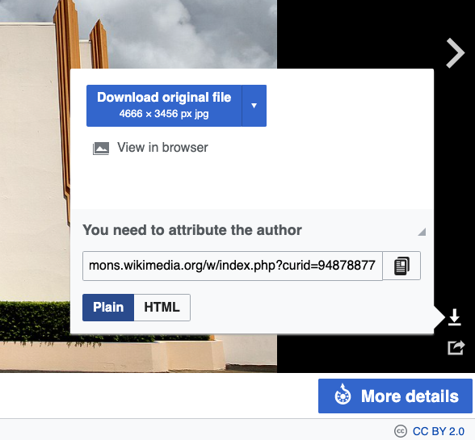

.. _pictures:

Pictures
=====================

To enrich your text, you can add pictures. Here's how.

1. **Directly from a website**, e.g.:

   .. code-block:: html

    

   **Please don't do this with any old website.** It has to be able to serve the image quickly to our users, which Wikipedia does. If in doubt, upload the image to our FTP server. 

2. **From our FTP server**, e.g.:
  
   .. code-block:: html

    
      
   Detailed instructions on uploading images are the section `How to upload pictures?`_ below.

**Important attributes**

*  MUST DO: **alt** -  alternate text for an image. Provides alternative information for an image if a user for some reason cannot view it (slow connection, an error, using a screen reader). e.g., ````
* Height, width — specifies dimension. E.g.: ````
* Aligning the image (right, left). E.g.: ````
* Centering the image — ``<center><figure></figure></center>``
* A good example of formatting an image with a caption you can shamelessly copy:
  
.. code-block:: html

  <center>
    <figure>
      
      <figcaption>
        <small>
          Figure caption (<a href="https://en.wikipedia.org/">wikimedia.org</a>)
        </small>
      </figcaption>
    </figure>
  </center>

You may also use :ref:`Markdown syntax to add images <markdownImages>` to your texts.

.. _textEditorPicturesUpload:

How to upload pictures?
-----------------------

1. Download Filezilla Client: https://filezilla-project.org
2. Install it on your computer.
3. Log in (details in the "`Omni Common <https://drive.google.com/drive/u/0/folders/1CW8H5OP9cdzvHRyO7IJR2tKHkBD20jUy>`_ → Shared Accounts" file).
4. Put the pictures you want to upload in the “images” folder. Make sure that the pictures are open source (good sources are, e.g., `www.pexels.com <https://www.pexels.com/>`_ or https://unsplash.com) and that they’re not too large (ideally less than 100 KB — you can decrease their file size by using, e.g., https://tinypng.com). Here is `how to resize images <https://omnigeneraltips.readthedocs.io/en/latest/generalTips/usefulStuff/pictures.html#how-to-resize-an-image>`_
5. The images are available at the following URL: ``https://uploads-cdn.omnicalculator.com/folder_name/file_name``. For example: https://uploads-cdn.omnicalculator.com/fbimages/car-vs-bike-screenshot.png
6. You can now add the image to the text using the ``img`` tag, as discussed in the previous section. Here's another example: 

   .. code-block:: html

      

Free to use pictures resources
------------------------------

* https://www.pexels.com/
* https://unsplash.com/
* Google → images → Tools → Usage Rights → Creative Commons licenses

Stock photo account
-------------------

Omni has an account with `Depositphotos <https://depositphotos.com/>`_. See the "`Omni Common <https://drive.google.com/drive/u/0/folders/1CW8H5OP9cdzvHRyO7IJR2tKHkBD20jUy>`_ → Shared Accounts" file for login details.

How to attribute the author?
----------------------------

**External sites:** Name of the picture (main domain www), e.g.:

.. code-block:: html

  <center>
    <figure>
      
      <figcaption>
        <small>Figure caption (<a href="https://www.example.com/">example.com</a>) </small>
      </figcaption>
    </figure>
  </center>

**Wikipedia:**

1. Select a picture on Wikipedia.
2. Click on the download button.
3. If you see, "You need to attribute the author", click on "Show me how" and copy and paste the attribution and format as the example below.
  
   .. code-block:: html

      <small>Skara Brae - Stone Age settlement (by Wknight94 - Own work, CC BY-SA 3.0, <a href=""https://commons.wikimedia.org/w/index.php?curid=2685554"">wikimedia.org</a>)</small>

4. If you see, "You can attribute the author", click more details and check the licensing and what you should do.
5. If public domain, it's free to use with no attribution.

.. _picturesWikipediaAttribution:


   Example of where you check to see if you need to give attribution to a picture on Wikipedia. 
