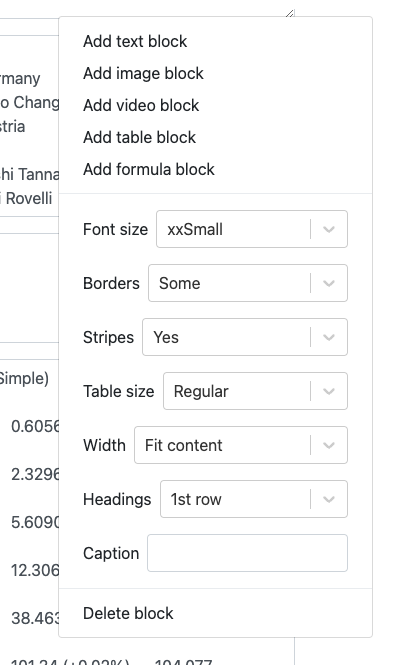

.. _textEditorTables:

Table block
===========

Tables can be embedded in the text using the table block. Here, we will briefly the most important tags and look at a few examples.

To **add a table block**, click on the three-dot menu of the content block above where you want to insert the table, and select **Add table block**.

Here is what is covered on this page:

.. contents::
  :local:

Entering data of a basic table
------------------------------

For a basic table with headings at the top and data going down, first enter the headings text, separating each one with a **tab key**.

Then enter each row of the table, again, separating each column of the table with a press of the tab key.

.. tip::

  If you want to use the table from **another website**, you should be able to simply copy and paste it into the table block content area.

For most tables, you should get a pretty good result. Let's look at example. For this text input in the table block:

.. code-block::

  Temperature (°C)	Pressure (kPa)
  0	0.6133
  20	68

…produces this result:

.. _tablesExample:

  Here's how the above table block input is rendered.

Next, lets look at the options of a table block.

.. note::
  You can use any :ref:`Markdown <markdown>` formatting and include inline LaTeX formulas.

.. _tablesOptions:

  Available options of a table block.

Font size
---------

Here you can set the size of the font to use in the table. This is useful for wide tables, where are smaller font might avoid the user scrolling horizontally. Or if it is a small table, a larger font might be nice.

Borders
-------

Set the amount of borders that are drawn. There are three choices available:

* **Some** — The Omni default table where there are mainly horizontal borders.
* **Bordered** — Every cell gets a border.
* **Borderless** — No borders are drawn.

Stripes
-------

This option controls whether every other row of the table has a light grey background (default). You may wish to remove these stripes for certain tables, though bear in mind that having them is generally good for readability.

Table size
----------

The option controls the padding around the text of each cell (but not headings). Using the **Compact** option might be a good idea to increase the date density and avoid horizontal scrolling.

Width
-----

With the width option, you can either have the size of the table fit the content (**Fit content**), or have the table take up the full width of the text column (**100%**).

Note that if the table is too big, it will still have to be horizontally scrolled, even if the width is set to 100%

Headings
--------

Controls whether the 1st row, 1st column, both should form the headings of the table. For some tables, it might make sense to have the headings as the first column, for example. Here are all the choices for the headings option:

* **1st row** — The default option is to have the first row to be the headings of the table.
* **1st col** — Use the first column as the headings of the table.
* **1st row & 1st col** — Use both the first row and first column as table headings.
* **None** — The table will have no headings – all cells will be equal.

Caption
-------

Here you may add a caption to the table, which will appear under the table.

Cell attributes
---------------

As well as defining the look of the table as a whole, you do have some options when it comes to the look of each cell, column and row. Let's go through the options.

Width — ``|width=n``
^^^^^

You can control the width of a column by adding ``|width=n``, where ``n`` is the number of pixels wide you wish the column to be. You can set this attribute is any cell within the column, but it probably makes the most sense to place it in the first row of a column.

Let's look at an example:

.. code-block::

  Temperature (°C)|width=100	Pressure (kPa)
  0	0.6133
  20	68

In this case, setting the width to a value smaller than content forces it to wrap.

.. _tablesCellWidthExample:

  The width of the first column has been set to 100 pixels.

.. note::
  If more than one cell in a column contains a width attribute, the **one with the greatest value** will be the one that is used.

.. warning::
  The preview of the table may look different when rendered on the website, so always save and double check, on desktop and mobile.

Text align — ``|left``, ``|center``, ``|right``
^^^^^^^^^^

Within a cell, you can align the text to the left (default), center or right. As an example:

.. code-block::

  Temperature (°C)|center	Pressure (kPa)|center
  0|left	0.6133|right
  20|left	68|right

So the headings will be centered, the first column of data is left aligned and the second column is right aligned.

Vertical align — ``|top``, ``|middle``, ``|bottom``
^^^^^^^^^^^^^^^^^^^^^^^^^^^^^^^^^^^^^^^^^^^^^^^^^^^

You can vertically align the contents of a cell by adding ``|top``, ``|middle`` (default), and ``|bottom`` after the cell's content.

Column span — ``|colspan=n``
^^^^^^^^^^^^^^^^^^^^^^^^^^^^

The column span attribute allows to you **merge two or more cells in the horizontal direction** (across columns). We do this by adding ``|colspan=n`` to the cell's contains, where ``n`` is the number of columns to span. Let's have a look at an example to see colspan in action.

.. code-block::

  65|colspan=2	40|colspan=2	20|colspan=2
  **Men**	**Women**	**Men**	**Women**	**Men**	**Women**
  82	85	78	82	77	81

This table is rendered as:

.. _tablesColspanExample:

  An example of a table with colspan cell attributes.

Row span — ``|rowspan=n``
^^^^^^^^^^^^^^^^^^^^^^^^^

The row span attribute allows to you to **merge two or more cells in the vertical direction** (i.e., down rows). We do this by adding ``|rowspan=n`` to the cell's contains, where ``n`` is the number of rows to span. Let's have a look at an example to see colspan in action.

.. code-block::

  |colspan=2  |empty			Bob	Alice
  Favorite|rowspan=2	Color	Blue	Purple
  |empty  Flavor	Banana	Chocolate
  Least Favorite|rowspan=2	Color	Yellow	Pink
  |empty  Flavor	Mint	Walnut

…which produces the table:

.. _tablesRowspanExample:

  An example of a table with rowspan cell attributes.

Note that in order to get the headings of Bob and Alice to appear in the correct column, we add ``|colspan=2`` to merge the two cells and an ``|empty`` element. There is more about the ``|empty`` attribute in the following section.

Empty cell — ``|empty``
^^^^^^^^^^^^^^^^^^^^^^^

When creating tables that contain colspans and rowspans, you should **keep the number of elements per row the same**. The ``|empty`` element is available to help you do this, as shown in the example in the previous section.

Background color — ``|aliceblue``, ``|lightskyblue``, etc.
^^^^^^^^^^^^^^^^^^^^^^^^^^^^^^^^^^^^^^^^^^^^^^^^^^^^^^^^^^

Each cell of a table can have a **custom background color**, which can be used to increase readability of the table. However, as we don't want too many colors on the website, you can only pick from a handful of colors, most of which fit in with the Omni website color scheme.

To add a background color, you just **add the color name** as an attribute of the cell. Here are the colors that are available:

``|aliceblue``, ``|lightskyblue``, ``|deepskyblue``, ``|mediumblue``, ``|cornflowerblue``, ``|darkblue``, ``|white``, ``|black``, ``|gainsboro``, ``|omnigrey``, ``|grey``, ``|darkseagreen``, ``|lemonchiffon``, ``|lightsalmon``, ``|lightpink``, ``|crimson``, ``|chocolate``.

And here is how they look on the website:

.. _tablesColorChart:

  Background colors available in table cells.

Images in cells – ``alt text|image=url``
^^^^^^^^^^^^^^^^^^^^^^^^^^^^^^^^^^^^^^^^

Instead of text, you can place an image in the cell of a table, using the syntax ``alt text|image=url``. Since we always have to have alt text with an image, the text before the pipe character ``|`` becomes the alt text. Here is an example:

.. code-block::

  Heading 1	Heading 2
  Text cell	Another text cell
  Text again	An image cell|image=system_of_equations_meme.jpeg

.. note::
  You'll see in this example that we only had to give the filename of the image for it to work. That's because this file is in the ``images/`` folder on the Omni FTP server. We could have specified the full URL ``https://uploads-cdn.omnicalculator.com/images/system_of_equations_meme.jpeg`` and got the same result. So that allows images from Wikimedia, for example, can be used directly. Though be careful about using any old website, that might be slow or not exist in the future. If in doubt, :ref:`upload to our FTP server <textEditorPicturesUpload>`.

That produces the following output:

.. _tablesImageExample:

  Example of adding an image to a table.

Mmmm, the image is probably a bit on the large side. The next cell attribute described below should be able to help with that.

Image width - ``imgwidth=n``
^^^^^^^^^^^^^^^^^^^^^^^^^^^^

To make the image in the example from the previous section smaller, we can **add the imgwidth attribute** that allows us to specify its width in pixels.

So if we change that cell to be ``An image cell|image=system_of_equations_meme.jpeg;imgwidth=50``, the result is:

.. _tablesImgwidthExample:

  Example of using imgwidth to control the size of an image in a table.

Combining multiple cell attributes
^^^^^^^^^^^^^^^^^^^^^^^^^^^^^^^^^^

Of course, you are not limited to using only one attribute per cell. You can combine any (in most cases) using a semicolon ``;`` as a delimiter.

General style guidelines
------------------------

For more information on the style guide required for tables, please check out the :ref:`Tables <textStylingGuideTables>` section in the Style Guide.

