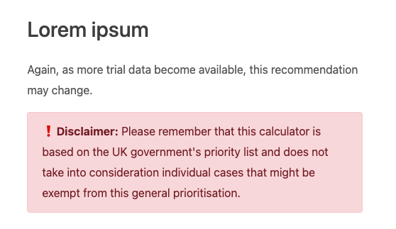

.. _textEditorTextBlock:

Text block
==========

The text block is where you can write text under a section heading. You use Markdown to format the text, add links, code, etc. Here are some other sections of the manual covering those topics.

* :ref:`markdown`
* :ref:`links`
* :ref:`Links to other calculators <linksTab>`
* :ref:`symbols`

.. warning::
  You are not meant to use HTML tags and will get a warning if you try to save text that has them. Later, you will be prevented from saving calculator texts containing HTML tags.

A text block has two options; **Format** and **Indent depth**. Let's explore these next.

Format
------

You can format a text block in one of three ways:

* **Regular** — Default text style.
* **Fine print** — Uses a smaller font. Good for disclaimers, etc.
* **InfoBox** — Creates a colored box with a fun emoji and optional title. Info boxes are good for short bits of information that doesn't fit in with the text, or some information or warning you want to highlight to the user.

InfoBox
^^^^^^^

.. _infoboxExample:

    Example of a warning info box.

The InfoBox option has the following options:

Infobox color set
"""""""""""""""""

Sets the emoji and background color of the info box. You can choose from the following options:

* 🙋 Primary — Light blue;
* 🔎 Secondary — Light grey;
* ✅ Success — Green;
* ❗ Danger — Light red;
* ⚠️ Warning — Light yellow;
* 💡 Info — Light teal; and
* ❓ Dark — Dark grey.
  
Custom title
""""""""""""

Replaces the emoji with the custom title. Useful if you would like to use a different emoji.

.. _textBlockIndent:

Indent depth
^^^^^^^^^^^^

Sets the indent depth of the text block allowing you to align and place where the text starts. Be careful though; setting the indent level too high will mean the text could disappear.

.. tip::
  You can use a **decimal number** for the indent value (e.g., 1.5). To properly align a text box with the bullet point text in a preceding text box, use an indent value of **1.5**. This is perfect if you have a LaTeX equation as part of a bullet list item and need to put text after the equation.

  .. figure:: img/indent-to-bulletpoint-text.png
    :alt: Example indenting a text box to preceding bullet point text
    :align: center
    :width: 100%

    Example indenting a text box to preceding bullet point text.

  