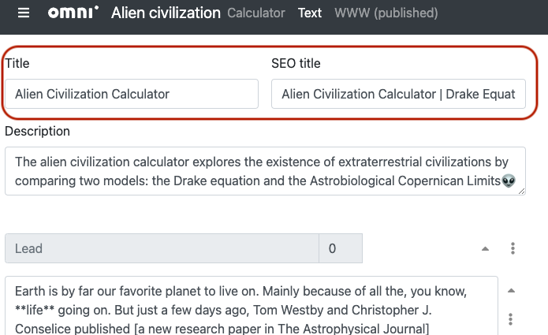
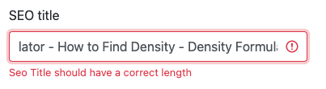

.. _title:

Title and SEO title
=====================

.. _titleExample:

    You'll find the **Title** and **SEO title** fields at the very top of the edit text page.

The **title** and **SEO title** input fields are two of the most important settings on the text editor page. Let's look at each one in detail.

Title
-----

The title of a calculator appears at the **very top** of the calculator and it lets the user know what the calculator is all about.

For regular calculators, the title will consist of the **main keyword** as specified in the :ref:`Mastermind spreadsheet <mastermind>` and include the word "Calculator". Converters may replace the word "Calculator" with "Converter".

Marketing calculators may have any title, as long as it is agreed with the marketing team, though they usually still have the word "Calculator" at the end.

Here are some points to considered when choosing a title for your calculator:

* DO **capitalize** the title according to `these rules <http://grammar.yourdictionary.com/capitalization/rules-for-capitalization-in-titles.html>`_;
* DO use the word **"Calculator"** in the title (unless it's a converter, counter, etc.); and
* DO make sure the first keyword is at the **beginning** of the title.

*Examples of good titles ✔️:* ROI Calculator – Return on Equity, Pressure at Altitude Calculator, Length Converter.

*Examples of bad titles ❌:* Return on Equity (ROI) calculator, Pressure at altitude, Length Converter Calculator.

SEO title
---------

The SEO title is a version of the calculator title that will be displayed on **search engine result pages** (though we only really care about Google).

For most calculators, the SEO title can be the same as the title. However, if there are high ranking secondary keywords, these may be placed after the title.

There is a **length restriction** with the SEO title though. It can be no longer than 600 pixels wide when using a 20 pt font. Don't worry. BB will let you know if your SEO title is too long, though it takes a few seconds to react to your changes.

.. _titleSEOtitleTooLong:

.. note::
  For most calculators, Google adds the site title "- Omni Calculator" on to the end of the SEO title. However, Google sometimes (in its infinite wisdom) doesn't add it. In any case, BB assumes the worse case and that Google will add it when calculating your SEO title's length. 

Here are to dos and don'ts when writing the SEO title for your calculator:

* DO **capitalize** the SEO title according to `these rules <http://grammar.yourdictionary.com/capitalization/rules-for-capitalization-in-titles.html>`_;
* DO use the **most searched phrase** at the beginning of the SEO title;
* DO add other phrases, if they **rank high** in SEO; and
* DON'T exceed the length limit, as advised by BB.

*Examples of good SEO titles ✔️:* Circumference Calculator, Acceleration Calculator, BMI Calculator - What's Your Body Mass Index?

*Examples of bad SEO titles ❌:* ROI, What's your BMI, acceleration calc

.. warning::
  If you **don't give an SEO title explicitly**, then it will be set to be the **same as the title**. If the title is too long, you may get the strange situation that BB is complaining about the SEO title being too long when there doesn't seem to be one.

  If you face this issue with a regular calculator, your title is probably **too long**. Or give a shorter version for the SEO title.

