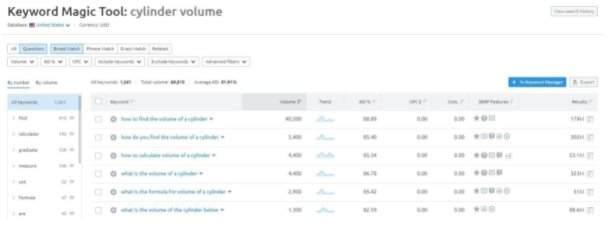

SEMrush
----------

Now that we’ve discussed the types of questions you should be looking for, it's time to look at where to find questions. Fortunately, the answer to this question is easy, **SEMrush**! SEMrush has a useful feature where it gives you the questions related to any keyword of your choice:

.. _SEMrush_main:

By **clicking on the blue number below the questions section**, you will be taken to this page:

.. _SEMrush_secondary:

From here you can look up commonly asked questions according to the guidelines above. Here’s a few notes:

* Always make sure that the question reads **how people would say it aloud**. This may require adding an additional word or two, but that is acceptable.
* Rewrite the sentence so that it is **spelt correctly**, please.
* Feel free to **change the phrasing**, e.g., to “How do I get…” from “How to get…”.
* **Explore other keywords** surrounding the topic to get more ideas. You can either think of related keywords yourself or use the Search Console.

Hopefully, by looking through a few keywords related to the subject, you’ll be able to find a sufficient number of decent questions. That’s not always the case though...
