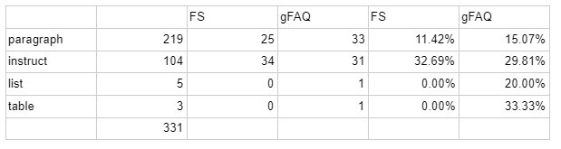

Answer type
===========

There are four main ways you can write your answer, as a paragraph, an ordered list (instructions), as an unordered list or as a table. Here is the answer types by their success from my FAQs: 

.. _answerType_table:

As you can see, instructions performed the best. This is because the questions that need instructions are also those that are the most related to Omni. For example, “How do I calculate a 10 % discount?” would require you to write a simple guide. Because we will be answering questions that are relevant to Omni, most of what you will be writing will be instructions.

You should however always choose the most relevant answer type to the question:

* **Paragraph** — Where full sentences are required, such as “Do you round midpoints?” or questions that need an immediate answer, e.g., “What is the midpoint of 0 and 5?”.
* **Instructions** — Where a step by-step guide is needed, e.g., “How do I find the midpoint of a triangle?”
* **List** — Often where you would use a paragraph, but would like to present the information succinctly, e.g., “What are the types of discount?”
* **Table** — Where you want to present a lot of numerical information quickly, e.g., “How much does a car depreciate per year?”

It is generally more important that you choose the **right answer type** for the question. Sometimes you might find that you can write your answer in any of the types. In this case, the priority is **Instruction > Paragraph > List > Table**.