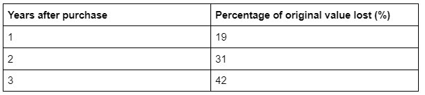

.. _examples:

Examples
=====================

Does arc length have to be in radians?
--------------------------------------

**Arc length** is a measurement of distance, so it cannot be in **radians**. The central angle, however, **does not have to be in radians**. It can be in any unit for angles you like, from degrees to arcsecs.

What is the midpoint of 0 and 5?
--------------------------------

**2.5**. To find the **midpoint** of any range, add the two numbers together and divide by 2. In this instance, **0 + 5 = 5**, 5 / 2 = 2.5.

How do you calculate basis points for commission?
-------------------------------------------------

1. **Divide the sale value by 100 to find 100 basis points**. We sold our stock option for $150000, so 100 bps is $150.
2. **Divide** this new number by 100 again to get 1 basis point. For our sale, 1 bps is $1.5.
3. **Multiply** the value for 1 basis point by **how many basis points you earn from commission**. We earn a 30 bps commission, so we earned $45 on our sale.

How do I add a percentage increase to a number?
-----------------------------------------------

If you want to **increase a number by a certain percentage**, follow these steps:

1. **Divide** the number you wish to increase by 100 to find 1% of it.
1. **Multiply 1% by your chosen percentage**.
1. **Add** this number to your original number.
1. There you go, you have just added a **percentage increase to a number!**

How do you find arc length without the radius?
----------------------------------------------

To calculate arc length without radius, you **need the central angle and the sector area**:

1. **Multiply** the area by 2 and divide the result by the central angle in radians.
1. **Find** the square root of this division.
1. **Multiply** this root by the central angle again to get the arc length.
1. The units will be the **square root of the sector area units**.

Or **the central angle and the chord length**:

1. **Divide** the central angle in radians by 2 and perform the sine function on it.
1. **Divide** the chord length by double the result of step 1. This calculation gives you the radius.
1. **Multiply** the radius by the central angle to get the arc length.

How do you check your body fat?
-------------------------------

* Skinfold calipers;
* Dual-energy X-ray Absorptiometry (DXA);
* Hydrostatic weighing;
* Bioelectrical Impedance Analysis (BIA); and
* **Body circumference measurements**.

How much does a car depreciate per year?
----------------------------------------

.. _examples_table:

