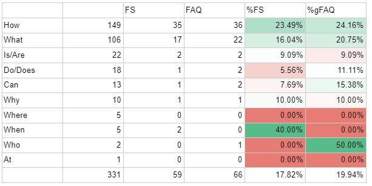

Question’s first word
=====================

Linked to what I’ve just said about :ref:`relatedness to Omni<relatednessToOmni>`, **certain question types (“How…”, “Can…”, etc) work better for us than others**. Here is a breakdown of the questions I wrote by first word and their success: 

.. _firstword_table:

As you can see, the questions that suit us best begin with “How…”, followed by “What…”. These are **the primary question types you should be writing, because they fit Omni well**: “How do I calculate square roots?”, “What is the square root of 2?”. And, even between these, “How…” questions do better.

Many “How…” questions come in the form “How do I.../How do you.../How to…”. In this case, **please use “How do I…” over “How do you…”**, unless of course you see a question which is extremely popular beginning with “How do you…”. As for “How to…”, there is a limited sample size but they seem to be effective, so if you would like to use a few, please do. They should however be limited to more academic questions, as nobody asks Google “How to lose weight?”, they are more likely to say “How do I lose weight?”.

This is not to say that you should write these question types exclusively, as you can see other words do see success and their data sizes are rather small, but **they should make up the bulk of your work**. If you see **a really interesting question** that works well with Omni that **begins with “Do…”**, by all means **go for it**, just make sure they **don't comprise more than half of all the questions** (unless you’re really struggling).
