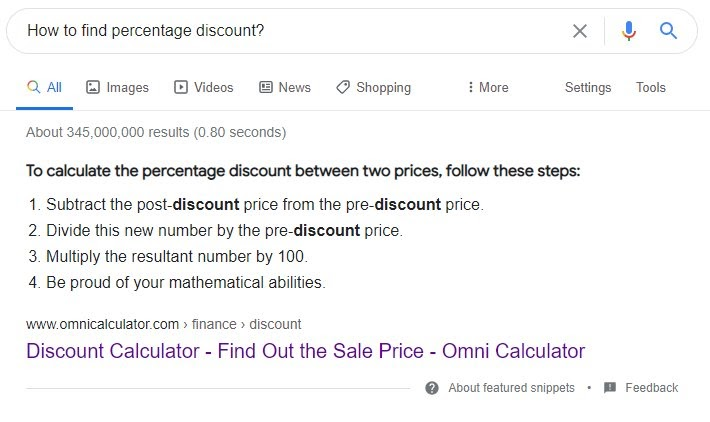

.. _faqGuide:

FAQ guide
=================================================

This FAQ guide provides information regarding compulsory FAQ sections in created calculators.

.. toctree::
    :maxdepth: 2
    
    goodQuestions
    pickQuestions
    answers
    integratedFAQ
    examples
    checkResults

.. _intro:

Introduction
------------

This is a guide on **how to write FAQs for calculators to maximise their chances of getting Featured Snippets (FS) and Google FAQs (gFAQs)** below calculators to maximise our SEO potential. These both serve a purpose, FSs are the result Google returns when you perform a voice search, and FAQs take up more space on Google. In terms of hierarchy, **getting FSs is more important than gFAQs**, and it should be thought of that “FAQs give us a nice way of writing and presenting questions primed to get FSs, with the added benefit of taking up more space on Google as gFAQs”. **This guide deals with the best way to get both**, but the philosophy of this being about voice searching should be kept in mind at all times.

.. _featuredSnippets:

   
   Example of Google's featured snippets

As with all things SEO, **getting the best results is not an exact science**. Because of this, the guide cannot supply you with all of the answers, and much of the time you will have to make your own call on how to proceed. These are **the key points** to consider when writing FAQs:

* Is this question **something someone would ask**, and is this how they would say it aloud?
* How **related to calculations and Omni** is this question, and does Google trust our answers to this topic?
* Does the answer answer the question immediately, and **how would it sound when read out loud**?

And this is on top of the regular SEO considerations. As I said above, getting FSs is all about optimising for voice searching, so, when in doubt, try to think about **FAQs as being questions asked aloud, with the answer spoken back**. Stick to this and everything will be okay. 

It should also be noted that getting FS and gFAQs is extremely hard; only 29% of my FAQs have succeeded in making it onto Google. But, **if you don’t get any, do not feel like your efforts have been in vain**. Firstly, FAQs hopefully provide you with **a nicer way of writing texts**, making your life easier. They also provide the calculator with more text, and Google does seem to prefer calculators with FAQs, even if it chooses not to display any; they saw **a 132 % increase in growth over those without**.

It should also be noted that **any text written in the FAQ section counts towards the calculator’s overall word count and SEO potential**; you don’t need to worry about writing 500+ words and then a number of FAQs on top of that. In this way, writing texts will hopefully be a little easier for you. 

As this is a new project, **the advice contained within this guide is subject to change**, especially as we collect more and more data. Any changes will be outlined in a **changelog**, available on Slack and in here.
