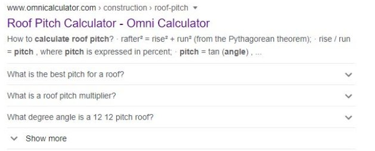

Question order
---------------------
The ordering of your questions seems to have some impact on performance. It’s important to note that the first 3 FAQs are displayed as gFAQs, followed by a “Show more” button:

.. _order_example:

As these 3 questions are the ones people will see without having to interact with our search result, they should be the most popular/interesting questions, to draw the reader in. After that, the ideal question order is one of descending order of popularity.

