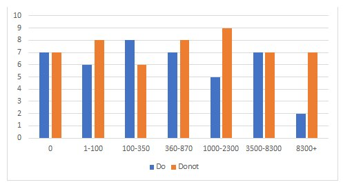

Don’t pick all of the most popular questions
---------------------------

Picking the 7 most popular questions might seem like a good idea as they’re very heavily searched for, but this isn’t always the case. This is because everyone else is also trying to write about them, and so **we are often outcompeted**. Therefore, about **half of your questions can be highly searched ones** and those integral to the calculator, e.g. “How to find density?” in the density calculator, but **the other half should be slightly more obscure**, such as how to’s for specific questions, e.g. “How to calculate the density of 1 m^3 of water?”, or where a specific answer is required, e.g., “What is the density of 1.5 m^3 of sea water?”. 

__Number of question that do or do not have FS or gFAQ vs. the_question’s volume in SEMrush__

.. _popular_graph:

   This does **change with our calculator’s popularity**, however. If we have a tool that **scores very highly in positioning** (ranks first or second for its main keywords on Google Search Console), then you can write **more of the high popularity** ones, because Google trusts us. If the **calculator is extremely unpopular**, you might only want to write **one or two popular questions**.
