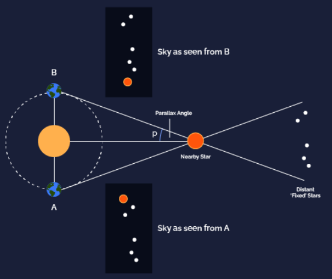

Alt text for images
===================

What is alt text?
-----------------

Alt text or alternative text is the text that we use to **describe the meaning and context** of an image on a webpage.

Why do we need alt text?
------------------------

Alt text provides context for search engine crawlers as well as users viewing our website with a screen reader. They are important as they serve the following purposes:

1. Search engine bots read alt text to **understand what the image is about** so that they can properly index and rank them in image search. Hence, properly optimized alt text can help us get more traffic from both Google and Google images.

2. Adding alt text to images is also very important from the principle of web accessibility. It enables **visually impaired people** to understand the image through the use of a screen reader.

3. Alt text is also displayed in the place of an image **if the image file cannot load**, thereby helping users with slow network connection.

   ؜

For example, Google can decipher that the picture shown above is about the Sun, the Earth and Stars. But we cannot guarantee that it will understand that the image is about the parallax effect. 

Hence, in the case of this picture, we could use the alt text: **“Parallax effect of a star as seen from two positions of Earth.”** It includes our relevant keyword (parallax effect), but also accurately describes what is happening in the picture.

How do I optimize my alt text?
------------------------------

Now that we know how important alt text is, let us see how we can optimize them. 

1. The alt text should be **descriptive and specific**. It should convey the essential information presented by the image. A way to decide about an appropriate alt text would be to close your eyes and have someone read the alt text to you. If you can imagine a reasonably accurate version of the image, you're good! 

2. To help in search ranking, it would be good to **use some relevant keywords** in the alt text. It is also perfectly okay to use a partial keyword, for example, the image shown in the previous section is from the parallax effect calculator. Its alt text only contains the keyword “parallax effect”. 

3. We should **never overstuff keywords** or use them if they are not relevant to the image. Spammy alt text can harm us.

4. It is usually advisable to **keep alt text around 125 characters or less** as some older assistive technologies process text in 125-character chunks. You don't need to count characters, a short phrase or a sentence is good enough. 

5. **Don't** use the words “image of”, “picture of”, etc in the alt text.

6. It is not a hard and fast rule, but the Web Accessibility Initiative **recommends using punctuations** in the alt text. It makes the information easier to understand when read by a screen reader. Capitalization is also recommended but not necessary. 

What does a good alt text look like? 
------------------------------------

   Image source: moz.com

**Bad alt text:** ``"Image of a man."``

**Okay alt text:** ``"Man on an escalator."``

**Better alt text:** ``"Man walking on an escalator."``

**Best alt text:** ``"Man wearing backpack walking down an escalator."``
