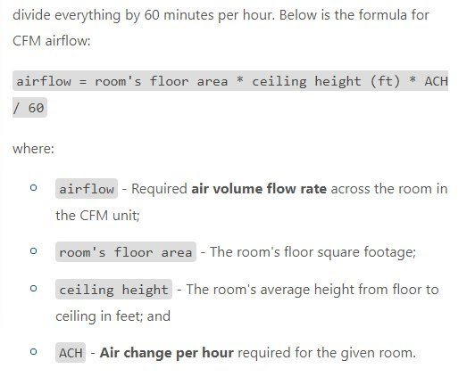
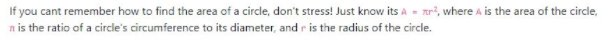

.. _equationsAndVariables:

Equations and their variables
=============================

Since here at Omni we calculate a lot of things, you will write a lot of equations. For a guide on how to write equations specifically, check out this :ref:`Equations <equations>` section and the :ref:`Formula block <textEditorFormulaBlock>`

Equations should be enclosed with a backtick ````` to distinguish them. 

Subscript and superscript should be used as appropriate. Some equations are important and essential for proper understanding of the concept. These should also be on its own line in the text, not as part of a paragraph and include a description of the variables underneath, separated by a “where:”.

The variables should be listed as **bullet points**, with the variables also surrounded with backticks ````` or :ref:`inline LaTeX <inlineLatex>`. Then follows a hyphen and a description of the variable, with the first letter capitalized. If the values in the list are a sentence or less, use the “; and” convention; if not, use fullstops throughout. Here’s an example: 

.. _equations_example1:


Bolding is optional, used for SEO purposes in this case.

You can instead write the variables with **words instead of symbols** (e.g., “mass at time t” instead of “mt”). However, keep in mind that this should only be used if the equation does not become unwieldy (i.e., taking up several lines) or if there is no commonly used symbol for the variables. If you have multiple equations, or have otherwise covered all of the variables before, there’s no need to repeat them.

(Also, if you have explained what all the symbols mean previously, you don’t need to worry about this.)

Sometimes you may want to input an equation for some lesser reason, perhaps to remind the user of a readily known equation, e.g. area of a circle. In this case the equation doesn’t need its own line but it does need to be backticked ````` and contain a description of the variables after, albeit just in a normal list:

.. _equations_example2:


Also, when using the symbols throughout the text, they should also be backticked ````` to make them noticeable to the user.
