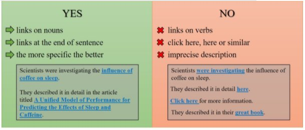

External links
==============

In general, it is okay to include external links in calculators. You can find how to add external links in :ref:`this section <links>` of the handbook.

There are a few things to consider though. External links send the user away from Omni and they may not return. This is obviously not good for business. Therefore, you **should only include external links to things that you cannot explain yourself**. This may include links to material beyond the scope of the calculator and sources/references.

Links should be applied to the text in a certain way too, as outlined in the image below:

.. _links_guide:

