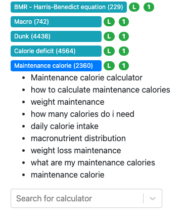
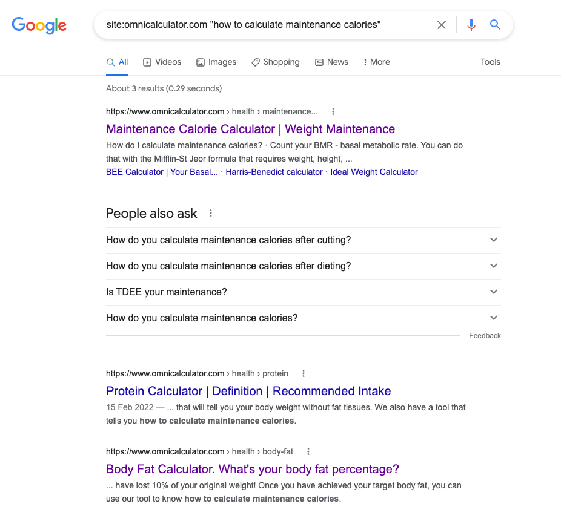

.. _internalLinks:

Internal links
==============

What are internal links?
------------------------

Internal links are hyperlinks between pages on the same website. We can classify them into two categories:

* Inlinks: Internal links to a URL
* Outlinks: Internal links from a URL

.. note::

   Internal links are different from **external links**, which point to pages on other websites – for example, when you link to a research article.

   **Backlinks** are hyperlinks that **point to our website** from other domains/websites. For example, all those lovely links that we share in the media channel. Backlinks increase our website's authority and help us rank better in the Google SERP. In fact, they are among the top 3 Google ranking factors.

Why do we care about internal links?
------------------------------------

1. Internal links help **Google discover, index, and understand** the pages on our website.
2. Internal links funnel **page authority and relevance** (that we earn from our backlinks) throughout our website. Pages on our website that receive lots of backlinks from trusted websites pass their earned authority to other URLs that they link to. These URLs, in turn, distribute that authority to other pages on our website.
3. Internal links **improve user experience** and conversions by helping users find our content easily.

Goals of internal linking
-------------------------

**From SEO/users perspective, we want our internal linking to be:**

1. **Relevant and natural:** To enhance user engagement, illustrate our expertise, and show the connection/relevance between content.
2. **Optimized anchor text:** To help Google understand the context of our content.
3. **Properly distributed:** Strongly linked to other pages to aid the flow of authority.

Basic guidelines 
----------------

For linking from your new calculator
^^^^^^^^^^^^^^^^^^^^^^^^^^^^^^^^^^^^

1. Include 3-5 internal links per calculator. The number of links should depend on the following:
   
   * Context of the calculator: It is easier to find relevant links for certain categories/topics but difficult for others.
   * Text length: The longer the text, the more links you can include naturally. But **do not add more than 5 links in one tool**.
   * Your own creativity: You can use phrasings like “If you want to do xxx, visit the yyy calculator”. You can occasionally use infoboxes as well but don't overuse them. If you can think of ways to include more links naturally, do share your tips with others! 

2. Always try to **link to calculators that are contextually relevant** to the tool you are creating. For example, linking the ideal gas law calculator to the other calculators in the Physics/thermodynamics category, especially Charles' law, Boyle's law, compressibility, Gay Lussac's law, etc.

3. While linking to a tool, try to **use one of the keywords as the anchor text**. For instance, for linking to the maintenance calorie calculator, the list of relevant anchor text is shown in the figure below.

4. Always give preference to exact match anchor text (i.e., maintenance calorie calculator) and then to long-tail keywords (i.e., how to calculate maintenance calories) or keywords involving the word “formula”. **Avoid using just the word “maintenance calorie” as the anchor text.**

5. **Don't use the same anchor text to link to two different calculators** in the same tool, for example, “Force” for both force calculator and force converter.

6. Don't link to the marketing calculators.

7. Try to put links **high up on the page** but remember relevance is the most important criteria.

8. The anchor text and the surrounding text to a link **should give an idea about the linked tool**. So refrain from using just “car” as an anchor text for the car crash calculator or any other car calculators. Users should get a clear idea by looking at the anchor text and surrounding text that the link mentioned is about car crashes.

9. Another thing that we should strictly **avoid is using only part of a tool's name as the anchor text**. For example, in “length conversion calculator”, using “conversion” as the anchor text and linking to some other converter.

.. note::
   You can add internal links to particular words or phrases within a sentence that provide a description of the tool. The following image serves as a guide:

   .. _links_guide:
   .. figure:: links_guide.jpg
      :alt: Where to add links
      :align: center

       

   You can also explicitly state that the **link is one of our tools**, e.g., “if you want to know more, check out our circumference calculator”. In this case, always refer to the calculator as “our” or “Omni's” or some similar way to let people know they're staying on the site. The link should be on the title of the calculator, e.g. “circumference calculator” in this example.

.. warning::
   **Do not add a list of links** to your calculator text, as this would lead to a clustering of links. It is better to have the links more uniformly distributed, with a bias for internal links higher up the page, where possible.

For linking to your new calculators after publication
^^^^^^^^^^^^^^^^^^^^^^^^^^^^^^^^^^^^^^^^^^^^^^^^^^^^^

.. seealso::
   You should also go back to **at least three** already published calculators and **add a link** pointing to your new calculator after it has been published. You can find more about this in the :ref:`Links from previous calculators <trelloLinks>` section.

10. Sometimes, if you are lucky, you will find relevant keywords in old calculators. But most of the time, you will have to **add one or two lines to include a link** to your newly created calculators. Try to follow the same guidelines as mentioned above in doing so.

11.   If an old calculator already has 100s of outlinks, try not to add a new link from that old calculator to your calculator. **The maximum number of links in an old calculator should be 20-25.** Try to **find tools that do not have many outgoing links**, but if you can't find any other relevant tools, go ahead and add the link. Better still, if it is a marketing calculator with lots of backlinks, a link from a tool with high backlink authority will help your tool rank better in Google.

12.   A simple hack to check for any existing tools with relevant keywords to add a link to your new calculator is to type ``site:omnicalculator.com “keyword”`` in Google. In the example below, you find that three calculators relevant to the keyword "how to calculate maintenance calories".

.. tip::

   For how to create internal links, please check out the :ref:`Links <links>` section of the text editor part of this handbook.
