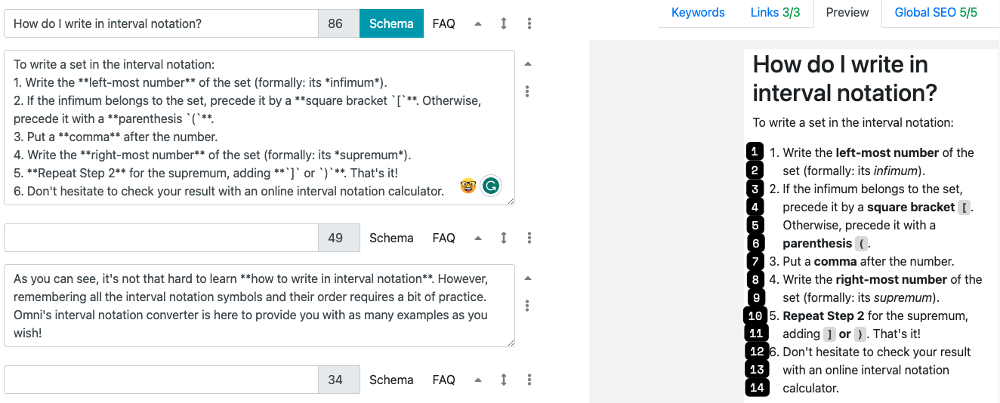
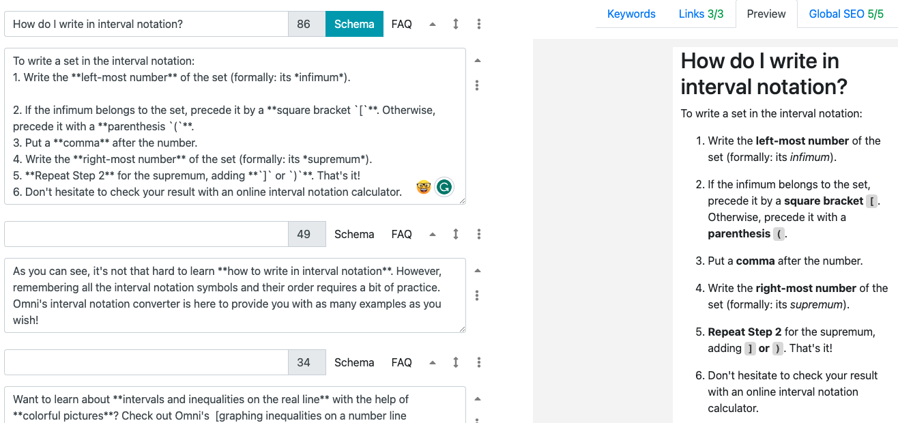
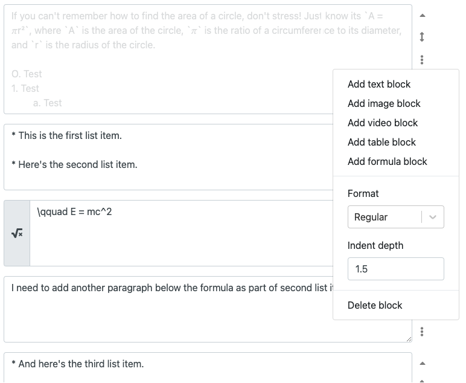
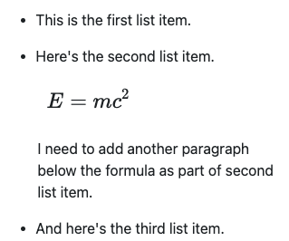

.. _textStylingGuideLists:
.. include:: /special.rst

Bulleted and numbered lists
===========================

All lists should have their entries **begin with a capital** (unless that word never has a capital). If a list (excluding sets of instructions) has **no entries that are more than one sentence** long then they should end with a **semicolon**, the penultimate entry should follow the semicolon with “and”, and the final entry should end with a full stop:

* Beginning;
* Middle; and
* End.

If a single entry is **more than one sentence**, all entries should end with a **full stop**.

Note that the sentence introducing the list should end in a **colon**.

When writing a **set of instructions**, please use an :ref:`ordered list <markdownOrderedLists>` (numbered). Ideally, the first word should be an imperative as well, but you can compromise on this in favour of a more informal style. Ordered lists can also be used to list ideas in **order of priority**, such as the ten best footballers.

You may also use lowercase letters for ordered sub-lists:

1. Item 1

  a. Sub-item 1
  b. Sub-item 2

:ref:`Unordered <markdownUnorderedLists>` lists can be used in many different ways, but if you want to use them to describing many different terms, please use this style:

* Mass spectroscopy — Where the molecules are ionized.
* Infra red — Where the molecules are dissolved in solution.

If you can't decide whether or not to use an ordered list or an unordered list, **choose unordered**.

In the case of **very short bulleted items**, we can omit punctuation marks:

:green:`Features implemented:`

* :green:`Sine`
* :green:`Cosine`
* :green:`Tangent`

Avoiding a wall of text
-----------------------

For bulleted lists (on mobile) and numbered lists, if the either the list contains too many items or the items are too long, this can lead to a wall of text which is not a great reading experience.

As a general guide, **if the number of lines in the text editor preview is more than 12**, then insert a blank line between at least one of the items.

Here is an example of a list that spans **14 lines** in the mobile preview:

  Click on image to increase size. Use the browser's back button to return to the Handbook.

By adding just a **single blank line** between one of the list items, all list items get some vertical space between them making them easier to read.

  ؜

Compound list items
-------------------

To add another paragraph to a list item, enter a tab (preferred) or 3 spaces, as discussed :ref:`here<markdownAddingElementsToListItems>`.

If you need to have a formula block (LaTeX equation) as part of a list item and need to write a paragraph afterward, create a new text block just for this paragraph and change the indentation on the block to 1.5 units. The paragraph will then be aligned with the text of the other items in the list.

Here is an example of the input:

  ؜

And this gives the output:

  ؜