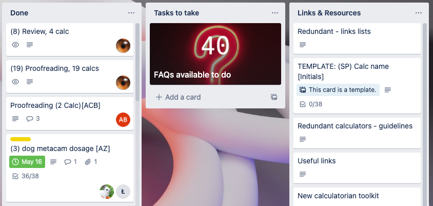
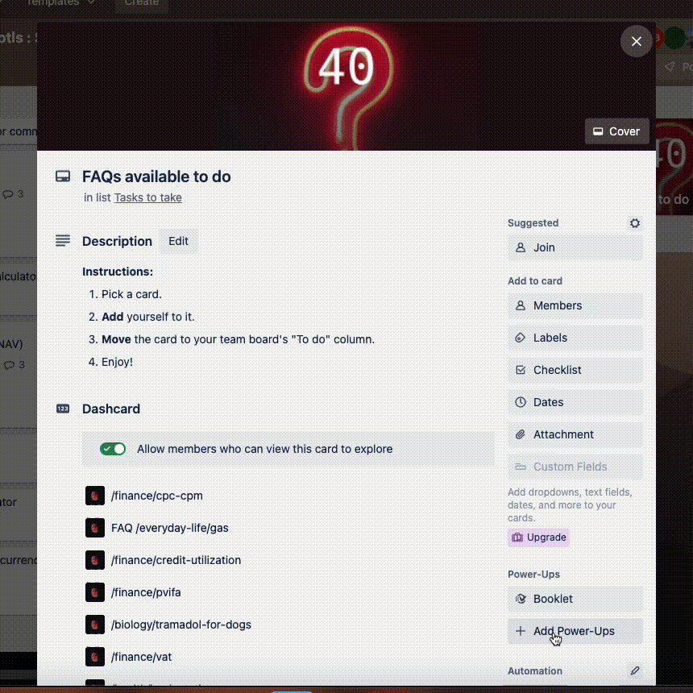
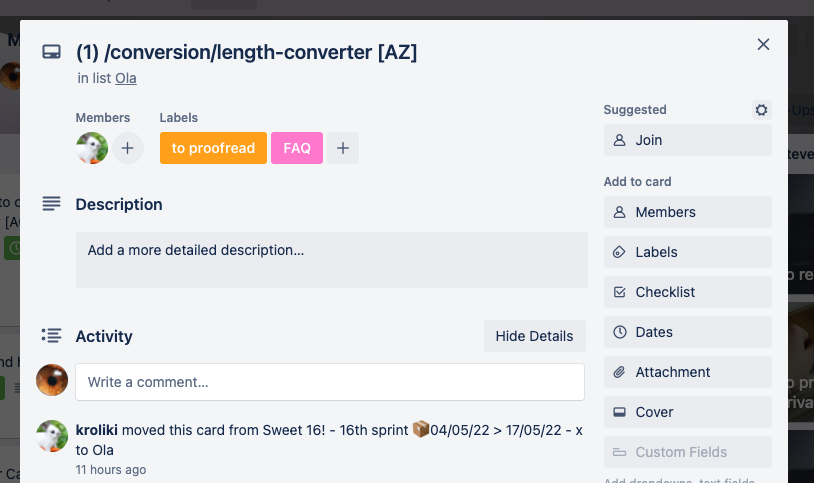

.. _faqtasks:

Adding FAQs to old calculators
==============================

This page of the Handbook sets out how to find an old calculator that needs FAQs added to it and the procedure to get them proofread and published.

Finding old calculators that need FAQs
--------------------------------------

On your team board, you will see a Dashcard that contains all the old calculators that need FAQs written for them. This is usually in the **Tasks to take** column of your team board.

    
    Here's where to find new FAQ tasks.

Click on a calculator you would like to add some FAQS to open up the Trello card.

.. tip::
  Click on **Explore** to see all of the FAQ tasks available.

The first thing to do is **add yourself** to the card.

Then you should **move** the card to your Power Team board and its **To do** column. Watch the GIF below to see how to do that in Trello.

    
    Here's how to move the FAQ task card to your own Power Team Board.

Use the :ref:`FAQ Guide<faqGuide>` in this Handbook to help you write the FAQs.

Getting FAQ tasks proofread
---------------------------

Once you have finished adding some FAQs to an old calculator, it's time to get them proofread and made live on the website.

To do that, **add** the orange ``to proofread`` label to the Trello card, along with the pink ``FAQ`` label.

    
    Add the orange proofread and pink FAQ label to the card.

Your card will then be placed in the FAQ proofreading queue on the main board.

Once it has been proofread and made live, the proofreader will add the green ``Published`` label to the card.