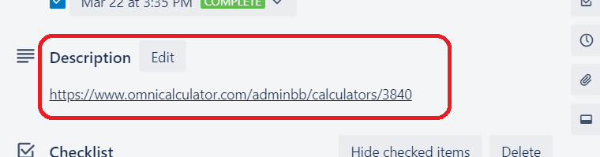

.. _trelloInstruction:

Instruction
=====================

How to add a new calculator on your Trello list:

1. Copy the card **TEMPLATE** to your list.
2. Change the title.
3. Add yourself to the card.
4. Add a *due date* - the day when you **expect** to finalize the calculator. Don't mark it complete yet!

.. note::
  It's a good practice to **add the calculator's link** into the card's description. Makes it easier to go directly from Trello to the calculator.

.. _instructionLinkDescription:

  A link to the calculator in Trello's card description.
