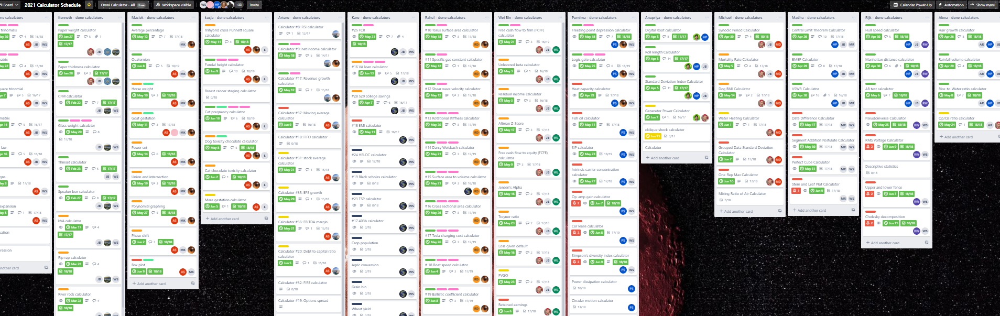

Trello
======

Trello helps us organize our work better. It keeps the *creating-reviewing-publishing calculators* process clear and efficient.

.. _introTrello:

    
    Calculators Schedule Trello page

Each calculatorian owns a **personal list** on their respective Power Team board. Every list consists of separate **cards, one for each calculator** or task.

For each sprint, first place cards in the **"To Do"** list for calculators and tasks you plan to do. Then move them to the **"Doing"** list when you are working on them. FInally, move them to the **"Done"** list when you have finished working on them.

.. warning::
  Make sure your cards in the "Done" column properly reflects what you have completed during a sprint before it ends.

.. note::
  Remember — Trello information should be always **up to date**.

.. toctree::
    :maxdepth: 3
    
    instruction
    reviewing/intro
    reviewers
    proofreading
    archive
    faq-tasks
