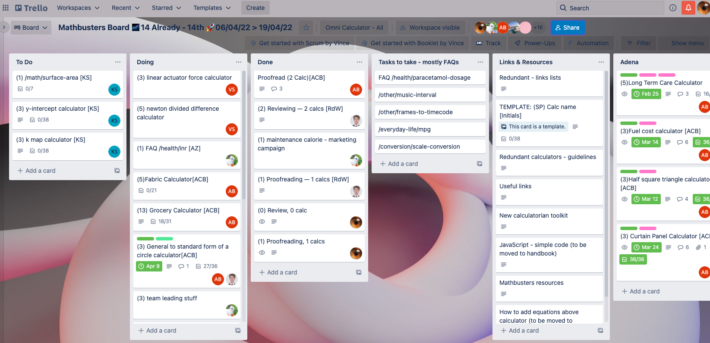

Trello
=================================================

Trello helps us organize our work better. It keeps the *creating-reviewing-publishing calculators* process clear and efficient.

.. _introTrello:

    
    Calculators Schedule Trello page

Each calculatorian owns a **personal list**. Every list consists of separate **cards, one for each calculator**.

.. note::
  Remember — Trello information should be always **up to date**.

.. toctree::
    :maxdepth: 3
    
    instruction
    reviewing/intro
    proofreading
    links
    archive
    
