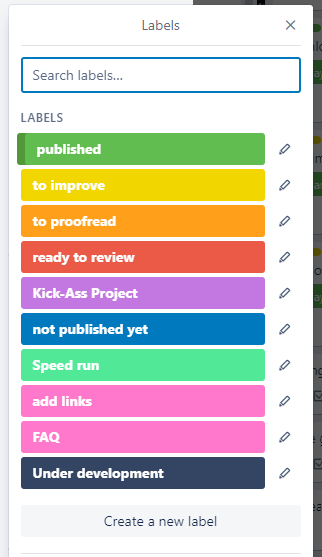

.. _labels:

Labels
=====================

We use labels to indicate the status of the calculator. Some of the labels may also help you find calculators from a particular project.

.. _labelsColors:

    The current labels' colors we use on Trello

These are currently used labels (person who adds):

* **Green** — Published calculator (proofreader);
* **Yellow** — To improve (reviewer if there are any changes or improvements to be made);
* **Orange** — To proofread (reviewer after the final check);
* **Red** — Ready to review (calculatorian, added automatically after selecting the *First review* button or manually after addressing all the changes from the review) – also "first FAQ check" (calculatorian who just started adding FAQs to their calculators);
* **Violet** — Kick-Ass Project (calculatorian if the calculator is a part of this project);
* **Blue** — Not published yet (proofreader, this calculator is done and proofread but sometimes we want to postpone the publishing for a specific date);
* **Pale Green** — Speed run, Redundant (calculatorian if the calculator is a part of this project);
* **Pink** — Add links (proofreader; a signal to the calculatorian to add links **to this new calculator** in at least 1 to 3 old, published calculators);
* **Black** — Under development (calculatorian, optional - e.g., you can distinguish between calculators you're currently working on and the ones you're planning to make in the future).
* **Grey** — These help with the review and proofreading procedure. Every calculator card should have one of these a supercategory labels:

  * Biology, Chem, Food, Ecology
  * Construct, Conversion, Everyday, Other
  * Finance
  * Finance (wide audience)
  * Health, Sport
  * Health, Sport (wide audience)
  * Math, Stats
  * Physics

  The other two grey labels have the following purpose:

  * reviewer added — Reviewers add this label when they take a calculator for review. Doing so removes the calculator from the available to review list on the main Trello board.
  * proofread added — Proofreaders add this label when they take a calculator to proofread. Doing so removes the calculator from the available to proofread list on the main Trello board.