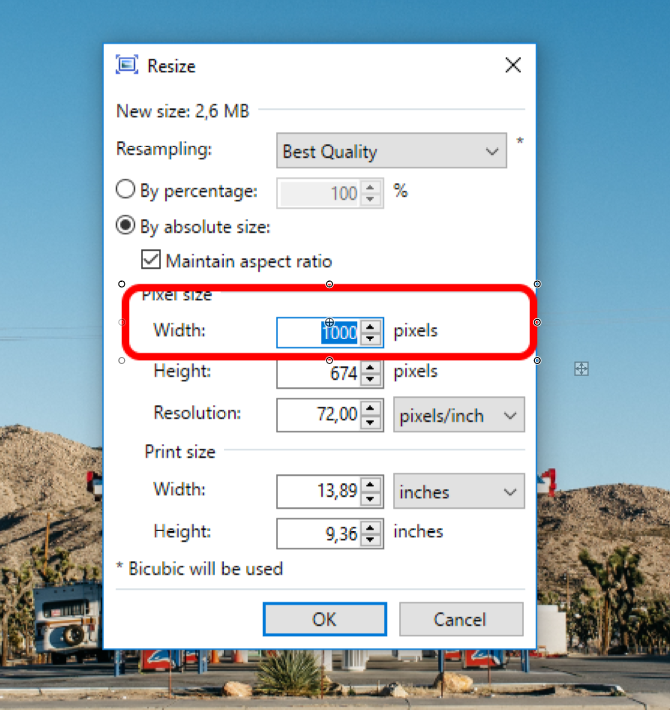

.. _pictures:
Pictures (copy-paste)
=====================

Check the following sites to download and edit images:

 * `<pexels.com>`__ and `<unsplash.com>`__ — databases with free pictures;
 * `<tinyjpg.com>`__ — reducing the image size.

How to resize an image?
----

To resize pictures, you'll need:

 * **paint.NET** (desktop application for Windows). You can download it `here <https://www.getpaint.net/>`__.
 * **tinyjpg.com** (web application).
 
Repeat these steps for every image:
 
1. **Download the selected image** from the Internet.
2. **Open	the image** in *paint.NET*. You can simply drag and drop it into the workspace.

.. _picturesDragDrop:
.. figure:: pictures_drag-drop.png
    :scale: 50 %
    :alt: Opening an image in paint.NET.
    :align: center

    
3. **Resize the image**. Set the image **width to 1000 pixels** (if the image is smaller, no need). The height will resize automatically. Click *OK* button.

.. _picturesResize1:
.. figure:: pictures_resize1.png
    :scale: 50 %
    :alt: Resizing an image in paint.NET.
    :align: center

.. _picturesResize2:

  
4. Set the **file type** and **saving location**.

.. _picturesSave1:

    
Use **JPEG format** and **name the image understandably**. If the image is not as detailed as a photo (chart, table, etc.), PNG might be a better saving format. Click *Save*.

.. _picturesSave2:

    
5. Set the **image quality**.

.. _picturesQuality:

    
In the boxes you can see **quality level** (``0-100``) and **predicted file size**. We suggest to **set the quality around 50-60** → image quality is still good and its size is acceptable. If the image quality will be bad in that range, set its higher value. **Remember to not exceed 100 KB image size** (200 KB in extreme cases).

6. Open `<tinyjpg.com>`__ and **upload the resized image**.

.. _picturesUpload:
.. figure:: pictures_upload.png
    :scale: 50 %
    :alt: Uploading an image quality to tinyjpg.com.
    :align: center
    
You can simply drag and drop the image or load it from a folder. tiny.jpg will drop the image size again (by deleting the metadata, etc.).

7. **Download the resized image**.

.. _picturesDownload:
.. figure:: pictures_download.png
    :scale: 50 %
    :alt: Downloading a resized image from tinyjpg.com.
    :align: center

You can see that some piece of image size was cut off.

Now, the image is ready for uploading via Omni FTP!

