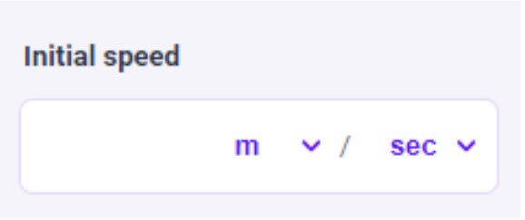

.. _uxVariableBlockDoubleUnitSwitcher:

Double unit switcher
====================

  A variable block with a double unit switcher to mimic the "speed" single unit switcher.

A double unit switcher is a unit switcher composed of two independent units.
The conversion factors of each unit are multiplied or divided (according to the user's need) to create a composite unit.
We use it in specific situations for quantities like speed (length over time), torque (force times distance), etc.
They are especially useful when the available units in the Unit Switcher are not the desired ones  — for example, the speed at which nails grow can have unit “nm/day”, which is missing from the “Speed” unit switcher.

When to use it
^^^^^^^^^^^^^^

* When two component units are not included in an already defined unit switcher.
* If you need to use more than 7 units in one unit switcher.

.. admonition:: Example

    The variable “Usage time” is well-suited to a double unit switcher of time/time. The user can select hours/day, or day/month, and much more. All for a unit switcher that has not even a clear naming!