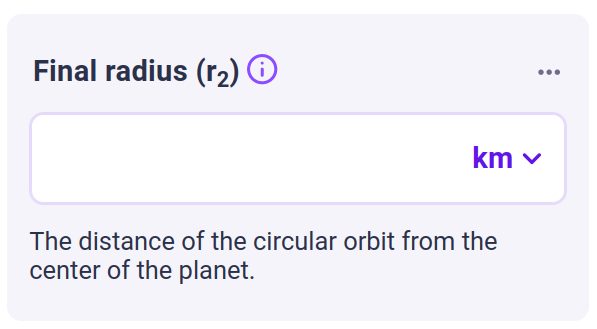

.. _uxVariableBlock:

Variable blocks
===============

The variable block is the basic element of a calculator.
A variable block corresponds to some input field (numeric inputs as well as dropdown lists, radio buttons, checkboxes).

    A typical variable block with a label, help text, and a unit switcher.

.. toctree:: 
    :maxdepth: 1
    
    label
    rounding
    minimumDecimalDigits
    unitSwitcher
    doubleUnitSwitcher
    monetary
    helpText
    outputOnly
    autosave