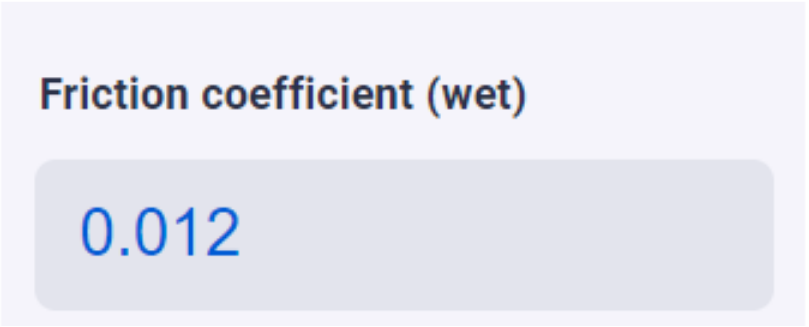

.. _uxVariableBlockOutputOnly:

Output only
===========

  A variable block that is output only. Its input field is read-only and grayed out.

This setting prevents the user's input on a variable block.
Its field becomes greyed out, however allowing the user to change the variable by means of a Unit Switcher.

When to use it
^^^^^^^^^^^^^^

* Use output only when the user should not be able to modify a result.

* Don't use output only to prevent the user from modifying a constant. Hide the constant directly.

* Use output only to prevent calculations in specific directions.

* Use output only to prevent mathematically incorrect operations.