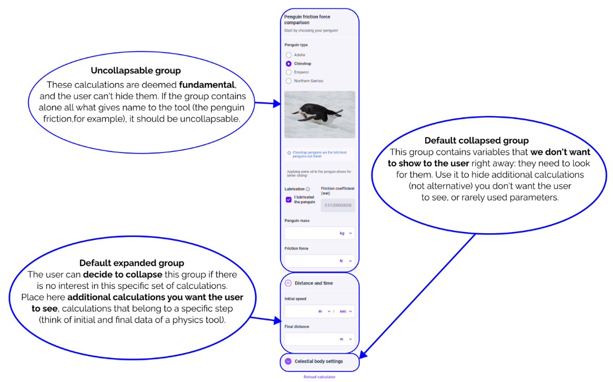

.. _uxGroups:

Groups
======

Groups are the main and most visually obvious way to split content in a calculator.
A group contains :ref:`blocks <uxBlocksSummary>` (which are grouped in :ref:`columns and matrices<uxMatricesColumns>`) that participate in the same calculations or are contextually connected.

    A breakdown of a group's anatomy.

Groups have the following attributes:

* A name, which will appear as a heading at the top of the group;
* An optional description, which will appear as a subheading below the name; and
* A collapsibility setting:
  
  * Uncollapsible; OR
  * Collapsable.  A group can be set as expanded or collapsed by default (i.e., when the calculator loads).

Uncollapsible groups
--------------------

These groups will always be expanded and the user cannot collapse it.

When to use uncollapsible groups
^^^^^^^^^^^^^^^^^^^^^^^^^^^^^^^^

We use uncollapsible groups when the content they contain must always be seen by the user.
The information contained there is fundamental, and the user shouldn't be able to hide it.

.. admonition:: Example

    The calculator Penguin Density Calculator calculates the number of penguins per square meter in a colony.
    It contains (1) a collapsible group of colony parameters, and (2) an uncollapsible group named "Penguin colony density".
    The second group is uncollapsible, because inside it we calculate what the user likely came to calculate.

**If only one group contains variable blocks, that group must be uncollapsible**.
The user shouldn't be able to hide the only group that calculates something.
This rule applies even if there are other groups containing only text blocks or image blocks.

.. _uxCollapsibleGroups:

Collapsible groups
------------------

When collapsed, a group shows only its title.
A collapsible group can be expanded and collapsed by the user at will, but the Calculatorian decides the group's initial state (i.e. its state once the calculator loads).

When to use default expanded groups
^^^^^^^^^^^^^^^^^^^^^^^^^^^^^^^^^^^

Use this type of group for content you want the user to see, but that it's not fundamental for the calculator (think of two groups that calculate similar things, additional calculations, etc.).
This content forms a consistent group, separated from (but not alternative to) the core calculations, and they add value to the tool.

.. admonition:: Example

    The calculator Decking Calculator contains a group called “Deck measurements” that the user can fill once and forget: this group is a default expanded group.
    The group “Results” is an uncollapsible group.

When to use default collapsed groups
^^^^^^^^^^^^^^^^^^^^^^^^^^^^^^^^^^^^

We use a default collapsed group for additional calculations or parameters that don't change the behavior of the calculator, and that would mostly clutter the tool.
Think of a set of additional parameters that are unlikely to change: the room temperature in a physics calculator, the planet where you are performing an experiment, etc.

.. admonition:: Example
    
    Jerry is building a calculator: his equations return a bunch of intermediate values of dubious importance.
    Jerry prefers to either hide the variables, or to tweak the equations rather than to use a default collapsed group! 

When one or more variables inside a collapsed block change value (due to inputs changing elsewhere in the calculator), they will show an indicator of the number of variables changed inside the group:

    Above, two values have changed inside the collapsed group.