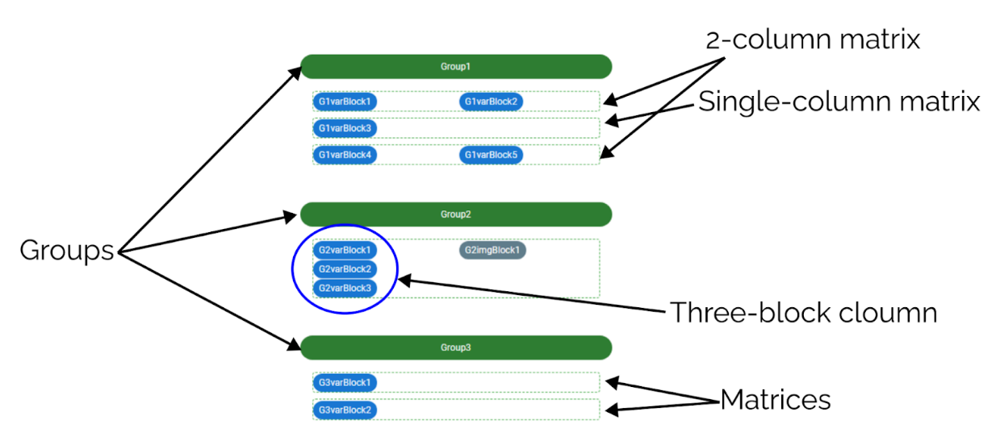

.. _uxV2Structure:

Structural elements of calculators
==================================

This section covers the general structure of a V2 calculator from a conceptual standpoint and the related UX principles.

A calculator in V2 is structured according to the following hierarchy:

1. The first subdivision of a calculator is in groups.
2. Each group contains one or more matrices. A matrix is an abstract object without a clear separation in the calculator we present to the final user.
3. A matrix contains columns which split the matrix vertically (you can have from one to four columns).
4. In each column, you can stack content blocks, following the guidelines for the proper layout of a calculator.

    
    A breakdown of a calculator's structure.

.. toctree::
    :maxdepth: 3

    groups
    matricesColumns
    blocksSummary